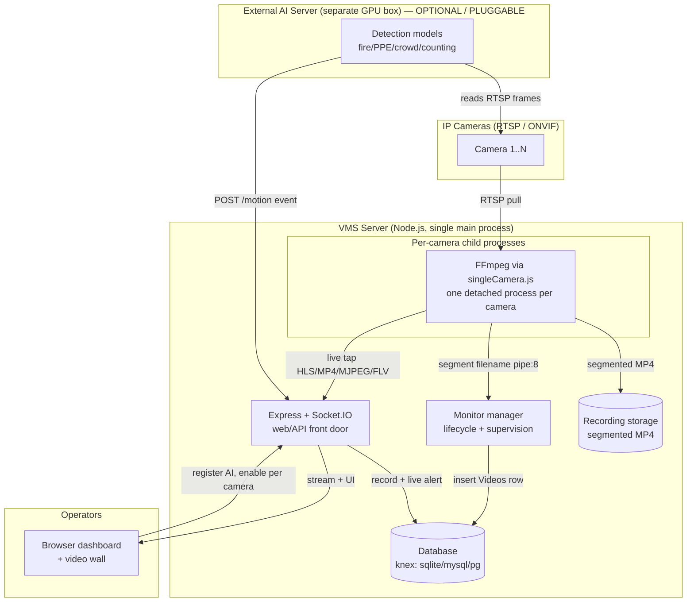
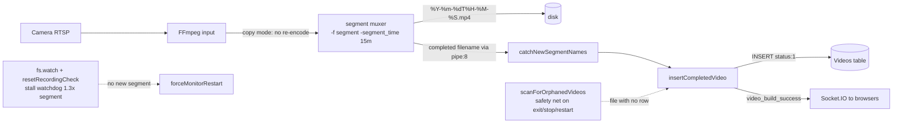
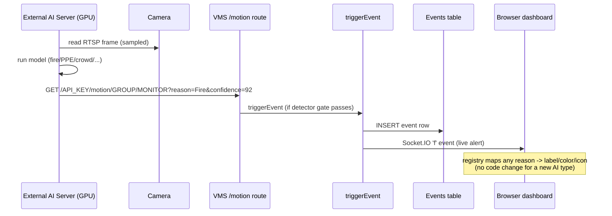
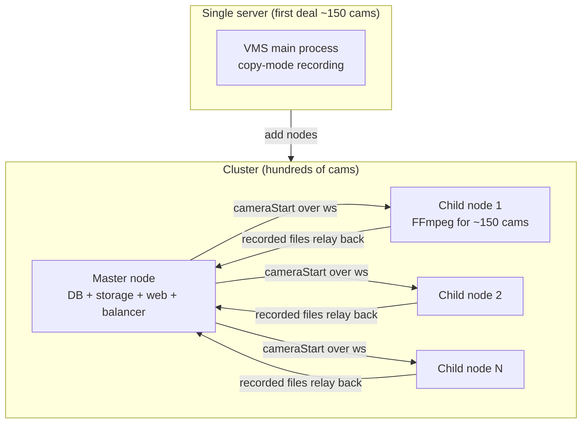

# VMS — High-Level Design (HLD)

**System:** LIMCO VMS (xeno-shinobi platform) — a production Video Management System
built on a hardened Shinobi core.
**Audience:** architects, the client's technical team, new engineers.
**Companion docs:** [`02-LLD`](02-LLD-Low-Level-Design.md) (per-function detail),
[`03-Data-Flow-and-APIs`](03-Data-Flow-and-APIs.md) (every flow + API catalog).

> This document is traced from the **actual code** (file:line references throughout) and
> was cross-verified by an independent pass. Where a claim was corrected during
> verification, the corrected fact is what appears here.

---

## 1. What the system is

A VMS whose job is to **connect many IP cameras, record them 24/7, stream them live, and
let operators review/export footage** — with **AI detection as a pluggable external
service**, never baked into the core.

**Design priorities, in order:**
1. **Recording is sacred** — 24/7, gapless, never lost/corrupted. Everything else is
   secondary.
2. Live streaming (including a wall of many cameras).
3. Camera discovery/onboarding (ONVIF), playback, clip export.
4. Horizontal scale toward hundreds → thousands of cameras.
5. AI is decoupled: an external GPU service posts detections in; the VMS stays generic.

**Core design decision that makes it scale:** cameras record in **`copy` (remux) mode** —
FFmpeg writes the camera's already-compressed H.264/H.265 straight to disk **without
re-encoding**. Per-camera CPU is therefore tiny; the real limits are disk throughput and
network bandwidth, not CPU.

---

## 2. The big picture

**Key seams:**
- **Camera ↔ VMS:** RTSP pull (the VMS connects to cameras). ONVIF for discovery + PTZ.
- **VMS ↔ AI:** two thin touchpoints — the AI reads camera RTSP for frames, and POSTs
  detections to the VMS `/motion` HTTP route. **The VMS has zero AI code.**
- **VMS ↔ Browser:** HTTP for pages/API/video files, Socket.IO for live push (events,
  status, stream signaling).

---

## 3. Subsystems (the components)

| # | Subsystem | Responsibility | LLD section |
|---|-----------|----------------|-------------|
| 1 | **Recording pipeline** | 24/7 gapless segmented recording → disk → DB rows, with orphan recovery + stall watchdog | LLD §1 |
| 2 | **Per-camera process model** | One detached FFmpeg-wrapper process per camera; stdio pipe map; supervision | LLD §2 |
| 3 | **Live streaming** | Tap FFmpeg output → HLS/MP4(mp4frag)/MJPEG/FLV → browser; on-demand substream lifecycle | LLD §3 |
| 4 | **Camera discovery + ONVIF + PTZ** | Find cameras on the LAN, pull profiles/RTSP URIs, register as monitors, PTZ control | LLD §4 |
| 5 | **Event / AI-integration** | The pluggable-AI seam: `/motion` → record + live broadcast; detection-agnostic | LLD §5 |
| 6 | **Database + schema** | One knex connection; portable schema; row-level multi-tenancy (`ke`/`mid`) | LLD §6 |
| 7 | **Web server + API + auth** | HTTP/WS front door; session vs API-key auth; ~130 routes | LLD §7 |
| 8 | **Multi-node cluster** | Master offloads cameras to child nodes for horizontal scale | LLD §8 |

---

## 4. The two flows that matter most

### 4.1 Recording (the priority feature)

**Three independent durability mechanisms** ensure a file on disk is never lost:
1. **Primary path:** FFmpeg's `-segment_list pipe:8` emits each finished filename →
   `catchNewSegmentNames` → DB row.
2. **Safety net:** `scanForOrphanedVideos` scans disk for files lacking a DB row and
   inserts them (on process exit, stop, and restart).
3. **Stall watchdog:** `resetRecordingCheck` restarts the camera if no new segment lands
   within ~1.3× the segment length; `fatalError` provides escalating restart backoff.

### 4.2 The pluggable-AI contract

The `reason` is an **opaque label**. A new detection type (crowd, PPE, anything) appears
in the UI with **no VMS code change** — the frontend event-registry gives it a default
style. This is the core of "one VMS, many clients."

---

## 5. Scale model — how it grows

- **~150 cameras:** one server, no cluster. Copy mode keeps CPU low; disk + NIC are the
  limits (≈600 Mbps, ≈75 MB/s at 150×4 Mbps).
- **Hundreds:** enable the built-in **master/child cluster** — the master auto-assigns each
  camera to the least-loaded child (CPU/RAM balancer); FFmpeg load spreads across machines.
- **Thousands (honest ceiling):** the **master centralizes DB + file storage + web + all
  child SQL**, so the master's event loop, disk, and NIC become the ceiling. Reaching true
  thousands needs a **phase-2 re-architecture** (shard storage/DB, add master HA). The
  cluster exists and works but was not designed for thousands on one master.

See `../SERVER_REQUIREMENTS_150_CAMERAS.md` for hardware and
`../load-test/LOAD_TEST_PLAN.md` for the staged validation (40→80→150→beyond).

---

## 6. Technology stack

| Layer | Technology | Notes |
|-------|-----------|-------|
| Runtime | Node.js 20 (single main process + detached child per camera) | pkg target retargeted 16→20 |
| Video engine | **FFmpeg** (records, streams, snapshots) | copy mode = no GPU for the VMS |
| Web | Express 4 + EJS templates | ~130 HTTP routes |
| Realtime | Socket.IO (optionally over the `cws` ws engine) | live events, status, signaling |
| DB | knex over **sqlite3 / mysql(2) / postgres** | portable; row-level `ke`/`mid` tenancy |
| Camera protocols | RTSP (main), ONVIF (discovery/PTZ), MJPEG/RTMP/HLS inputs | |
| Live delivery | HLS, **MP4/mp4frag (MSE, low-latency)**, MJPEG, FLV | per-monitor `stream_type` |
| Packaging | Docker (dev) / native Linux (recommended prod) | deps live in Docker volume |

---

## 7. Cross-cutting concerns

- **Auth:** every route is gated by `s.auth` — either a logged-in **session** (IP-bound) or
  an **API key** scoped to a group. Sub-accounts get per-monitor permissions. (LLD §7)
- **Multi-tenancy:** row-level via `ke` (group/customer key) + `mid` (monitor id) on nearly
  every table. No foreign keys.
- **Supervision:** each camera self-heals — stall watchdogs + escalating restart backoff +
  orphan recovery. A dead camera never takes down others (process isolation).
- **Storage management:** disk-usage counters + automatic purge of over-quota footage.
- **Known hardening done** (branch `vms-core-hardening`): orphaned-FFmpeg-leak fix, timeout
  leak fix, async spawn write, body-limit scoping, removed fake-event injector, dependency
  vulns 24→4, generic data-driven detections UI. See `../VMS_PLATFORM_ARCHITECTURE_PLAN.md`.
