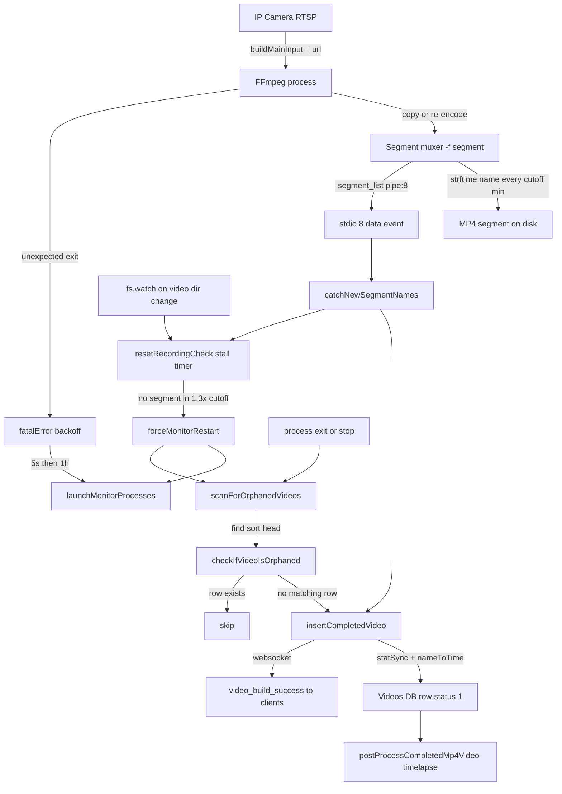
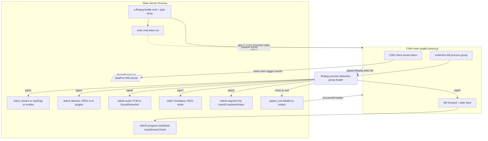
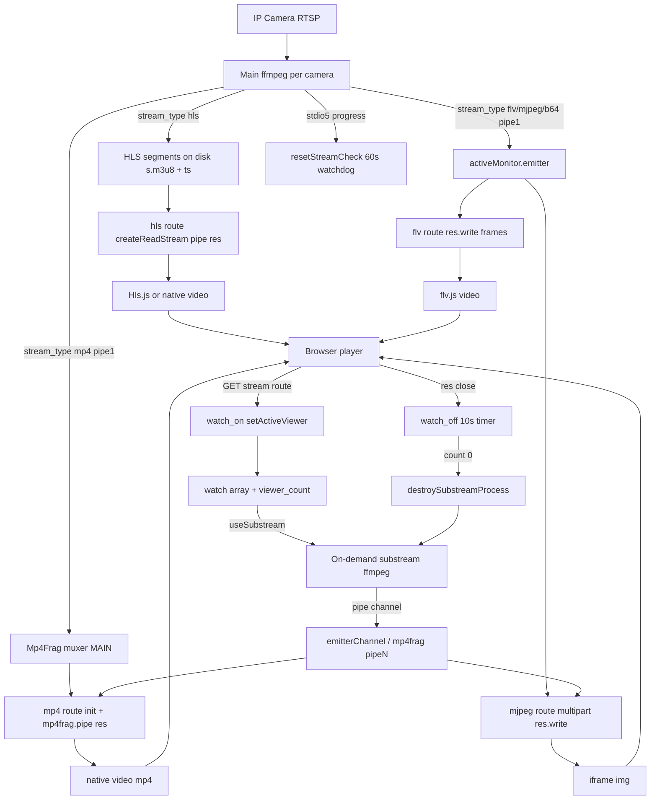
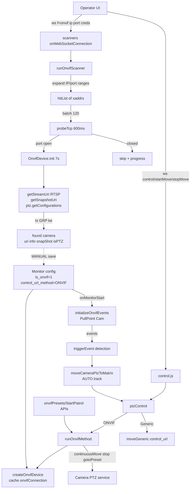
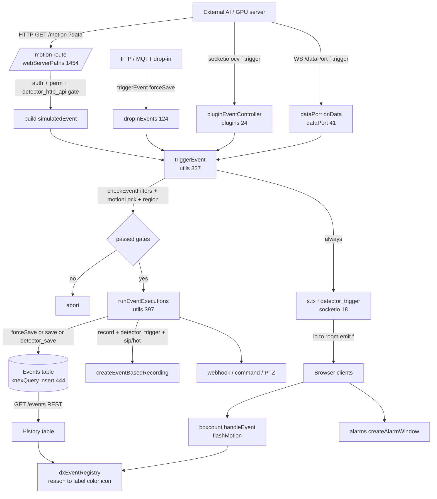
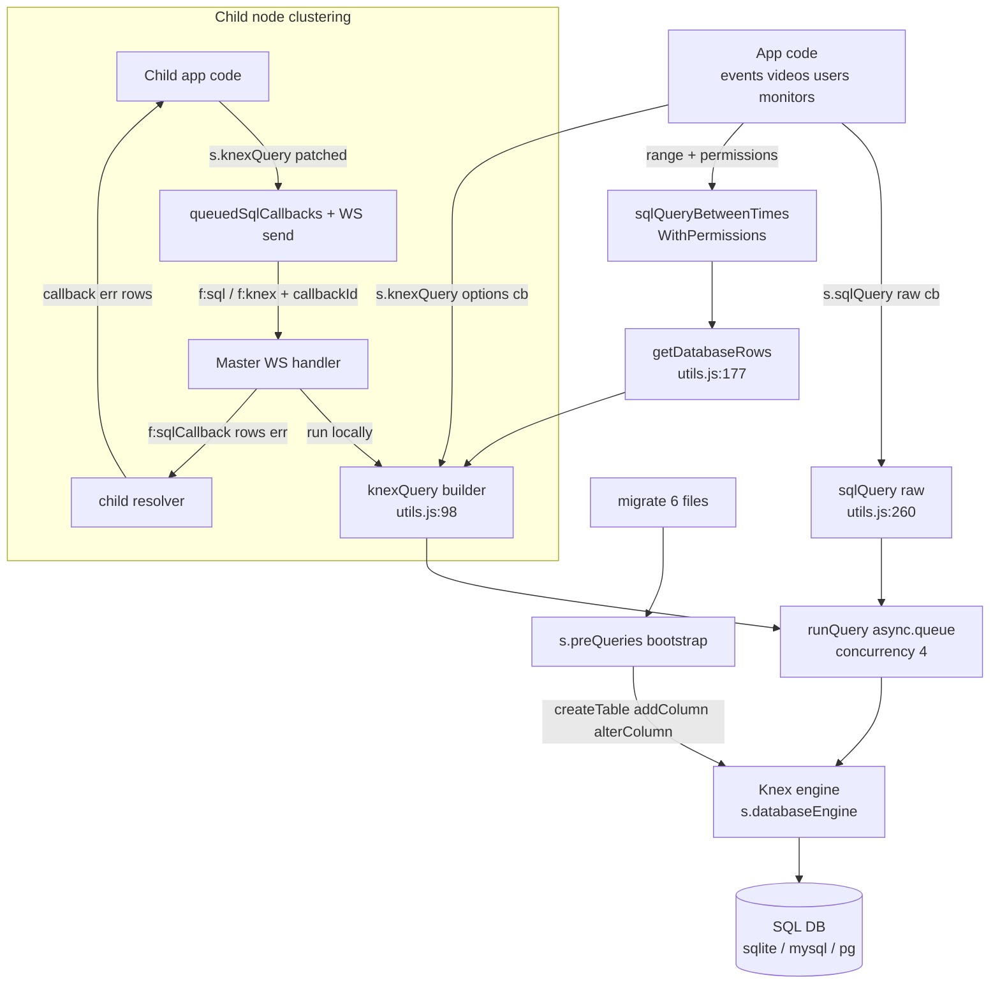
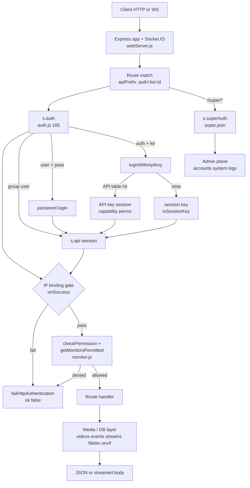
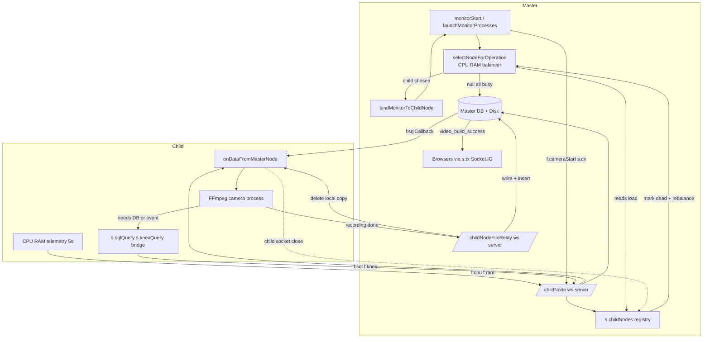

# VMS — Low-Level Design (LLD)

Per-subsystem detail traced from the actual code (file:line). Companion to [`01-HLD`](01-HLD-High-Level-Design.md). Every subsystem below has: purpose, key functions, the algorithms, a data-flow table, and a diagram.

> Verified by an independent pass. Corrections found during verification are folded into the facts below.

## Table of contents

1. [24/7 Continuous Recording Pipeline](#1-247-continuous-recording-pipeline)
2. [Per-Camera Process/Thread Model](#2-per-camera-processthread-model)
3. [Live Streaming Pipeline](#3-live-streaming-pipeline)
4. [Camera Discovery + ONVIF + PTZ](#4-camera-discovery-+-onvif-+-ptz)
5. [Event / AI-Integration Path](#5-event--ai-integration-path)
6. [Database Layer & Schema](#6-database-layer-&-schema)
7. [Web Server, API Surface & Authentication](#7-web-server,-api-surface-&-authentication)
8. [Multi-Node / Horizontal Scaling Cluster](#8-multi-node--horizontal-scaling-cluster)

---

## 1. 24/7 Continuous Recording Pipeline

**Full name:** 24/7 Continuous Recording Pipeline (RTSP to segmented MP4 to DB Videos rows to orphan recovery)

**Purpose.** This is the #1 priority feature: unattended, gapless 24/7 recording of every camera to disk as time-named MP4 segments, each of which becomes a queryable row in the `Videos` DB table. The design goal is durability: FFmpeg is run in `-f segment` mode so the recording is rotated into fixed-length files (default 15 min) without ever stopping the input, meaning a crash loses at most one in-progress segment. The pipeline is deliberately built with two independent "a segment became a file" detection paths — (1) FFmpeg's own segment-list callback over pipe:8 (the primary, real-time path), and (2) a periodic filesystem scan (scanForOrphanedVideos) plus a per-directory fs.watch that both act as safety nets so a file on disk is never left without a DB row (an "orphan"). A separate stall watchdog (resetRecordingCheck) restarts the camera process if no new segment lands within ~1.3x the segment length, and fatalError provides escalating restart backoff so a dead camera keeps retrying without pinning the CPU.

### Diagram

### Key functions / modules

| Function | Location | What it does |
|---|---|---|
| `buildMainRecording` | `backend/libs/ffmpeg/builders.js:537-623` | Builds the FFmpeg recording output segment of the command, but ONLY when e.mode==='record'. Chooses copy vs re-encode (vcodec==='copy' skips scaling/crf/fps filters entirely), sets codecs (mp4 defaults libx264/aac; webm defaults libvpx/libvorbis), applies -crf/-q:v, timestamp/watermark/rotation -vf filters, movflags=faststart per-segment, and terminates with the segment muxer: `-f segment -segment_atclocktime 1 -reset_timestamps 1 -strftime 1 -segment_list pipe:8 -segment_time <cutoff*60> "<dir>%Y-%m-%dT%H-%M-%S.<ext>"`. The -segment_list pipe:8 is what emits each completed filename to the parent. |
| `s.ffmpeg` | `backend/libs/ffmpeg.js:27-133` | Assembles the full FFmpeg command by concatenating buildMainInput + all outputs (stream, jpeg, recording, detectors, timelapse), writes it to a cmd_<token>.txt file, and spawns a detached node child (cameraThread/singleCamera.js) that actually runs FFmpeg. stdio is an array of 'pipe' fds sized by createPipeArray; pipe:5=progress, 6=audio, 7=timelapse, 8=segment-list. Returns the cameraProcess used as activeMonitor.spawn. |
| `createPipeArray` | `backend/libs/ffmpeg/utils.js:176-186` | Sizes the stdio pipe array to config.pipeAddition (base fds 0-8) plus one extra per stream_channel, guaranteeing fd 8 exists to receive the -segment_list output. |
| `launchMonitorProcesses` | `backend/libs/monitor/utils.js:1590-1790` | Orchestrates camera startup: creates recording/stream/timelapse/fileBin folders, installs the fs.watch recording watcher on e.dir (non-mac, record mode), optionally ping-tests the host, then via startVideoProcessor -> createCameraFfmpegProcess spawns FFmpeg and wires catchNewSegmentNames + cameraFilterFfmpegLog. Runs through a per-group start queue to throttle mass starts. |
| `catchNewSegmentNames` | `backend/libs/monitor/utils.js:1412-1463` | PRIMARY segment->DB path. Attaches a data handler to activeMonitor.spawn.stdio[8]; when FFmpeg writes a completed segment filename (matched by the T##-##-##. regex), it derives the filename, calls s.insertCompletedVideo to create the DB row, optionally deletes motionless videos or queues auto-compression, and calls resetRecordingCheck to re-arm the stall watchdog. |
| `s.insertCompletedVideo` | `backend/libs/videos.js:105-201` | Turns a finished segment file into a Videos row: resolves the file across main + addStorage dirs, stat()s it for size, derives startTime from filename via nameToTime and endTime from mtime, emits video_build_success over websocket, updates disk-usage counters, purges over-quota storage, then s.insertDatabaseRow inserts into Videos and postProcessCompletedMp4Video runs (timelapse frame extraction). |
| `s.insertDatabaseRow` | `backend/libs/videos.js:70-103` | Performs the actual knex INSERT into the `Videos` table with ke, mid, time(start), end, ext, status:1, details, objects, size. |
| `scanForOrphanedVideos` | `backend/libs/video/utils.js:60-163` | SAFETY-NET path. Writes a temp shell script that lists the N most-recent files in the video dir (find \| sort -r \| head), then for each checks checkIfVideoIsOrphaned; any file >10 bytes with a valid name but NO matching Videos row gets a row created via insertCompletedVideo. Guarded by forceCheck/config.insertOrphans; has a 10s inactivity killer. Invoked on process exit, stop, and restart. |
| `checkIfVideoIsOrphaned` | `backend/libs/video/utils.js:22-59` | For one file: stat() (must be >10 bytes), SELECT from Videos WHERE ke/mid/time=nameToTime(filename); if no row, insertCompletedVideo (status 2 = was orphaned) else status 1. |
| `resetRecordingCheck` | `backend/libs/monitor/utils.js:1048-1069` | Stall watchdog. (Re)arms activeMonitor.recordingChecker for 60000 * segmentLength * 1.3 ms; if it ever fires while the monitor is still in record mode, it calls forceMonitorRestart — i.e. no new segment within 1.3x the cutoff means the camera stalled, restart it. Re-armed on every new segment and by the fs.watch 'change' event. |
| `fatalError` | `backend/libs/monitor/utils.js:1791-1823` | Escalating restart backoff. Increments errorFatalCount; schedules launchMonitorProcesses after 5s for the first 2 failures, then 1 hour once errorFatalCount>=3 (backoff to avoid CPU pinning on a permanently-dead camera). If monitorDetails.fatal_max is set and exceeded, stops the camera instead. Count is reset to 0 after 60s of stability. |
| `forceMonitorRestart` | `backend/libs/monitor/utils.js:1014-1036` | Restart primitive used by the stall watchdogs: relaunches via launchMonitorProcesses then runs scanForOrphanedVideos(forceCheck,checkMax:2) so any segment written just before the stall is recovered. |
| `cameraDestroy` | `backend/libs/monitor/utils.js:125-230` | Tears down a camera: clears recordingChecker/streamChecker/fatalErrorTimeout and all timers, unpipes stdio, resets/destroys mp4frag muxers, and calls processKill (graceful 'q' to FFmpeg stdin, then SIGTERM/taskkill, then treekill) so no orphaned FFmpeg/node process leaks. |
| `nameToTime` | `backend/libs/basic.js:105-110` | Converts a segment filename (2026-07-18T14-30-00) back into a DB timestamp string (2026-07-18 14:30:00) by splitting on '.', 'T' and replacing '-' with ':' in the time part. This is the inverse of the strftime pattern and is the join key between a file on disk and its Videos row. |

### Algorithms

**Segment rotation (gapless 24/7)** — `builders.js:619`
1. FFmpeg opened once with a single input and kept running continuously
2. -f segment mux splits output into fixed windows of segment_time = cutoff(minutes)*60 seconds (default 15 min)
3. -segment_atclocktime 1 aligns segment boundaries to wall-clock so files start on clean minute boundaries
4. -strftime 1 names each file from the segment start time: %Y-%m-%dT%H-%M-%S.mp4
5. -reset_timestamps 1 makes each segment start at PTS 0 so it plays standalone
6. On each boundary FFmpeg closes the finished file (movflags=faststart applied) and immediately opens the next — the input never stops, so at most the in-progress segment is lost on a crash
7. -segment_list pipe:8 writes the just-closed filename to fd 8

**Copy vs re-encode mode selection** — `builders.js:544-611`
1. videoCodecisCopy = (details.vcodec === 'copy')
2. If copy: skip -s scale, -crf/-q:v, fps filter, timestamp/watermark/rotation -vf (they require decoding) — packets are muxed as-is, near-zero CPU
3. If not copy: pick codec (mp4 default libx264 / webm default libvpx), add -crf (mp4, non-hwaccel) or -q:v, add fps/scale/rotation/timestamp/watermark filters, optional -preset
4. Audio: for h264/hls/mp4/local inputs, 'no' -> -an, else -acodec <codec>
5. copy mode is the intended 24/7 default for RTSP H.264 cameras (CPU-cheap, scales to many cameras)

**Recording stall watchdog + restart** — `monitor/utils.js:1048-1069,1640-1646`
1. resetRecordingCheck arms a timeout of 60000 * segmentLength * 1.3 ms
2. Timer is re-armed on every new segment (catchNewSegmentNames) AND on any fs.watch(e.dir) 'change' event
3. If the timer fires while monitor is still mode==='record' and isStarted, forceMonitorRestart is called
4. forceMonitorRestart relaunches the process, then scanForOrphanedVideos(checkMax:2) recovers the last segment(s)
5. Net effect: no new file within 1.3x the segment length is treated as a stall and self-heals

**Orphaned-video recovery** — `video/utils.js:60-163`
1. Triggered on unexpected exit (spawn_exit), monitorStop (+2s), and every forceMonitorRestart; gated by options.forceCheck OR config.insertOrphans
2. Write a temp sh script: find <videoDir> -maxdepth 1 -type f | sort -r | head -n checkMax (newest first)
3. For each listed file: stat must be >10 bytes and name must contain '-' and '.'
4. SELECT Videos WHERE ke,mid,time = nameToTime(filename) LIMIT 1
5. If no row exists -> insertCompletedVideo creates it (marked status 2 = recovered orphan), increment orphanedFilesCount
6. 10s inactivity timer and the sh 'close' event both drive onFinish so the scan can never hang

**Escalating fatalError restart backoff** — `monitor/utils.js:1791-1823`
1. Every fatal condition (spawn exit, ping fail, spawn error) calls fatalError, which ++errorFatalCount
2. If fatal_max set and errorFatalCount>fatal_max -> s.camera('stop') (give up)
3. Else schedule launchMonitorProcesses after 5000ms for the first 2 failures
4. Once errorFatalCount>=3 -> back off to 1 hour (1000*60*60) between retries to avoid CPU pinning on a dead camera
5. A 60s stability timer resets errorFatalCount to 0, so a camera that recovers returns to fast-retry behavior

**Segment file -> DB row join key** — `basic.js:105-110, videos.js:142`
1. File written by strftime as YYYY-MM-DDTHH-MM-SS.ext
2. nameToTime reverses it: split off ext, split on 'T', replace '-' with ':' in the time half -> 'YYYY-MM-DD HH:MM:SS'
3. This derived timestamp is stored as the Videos.time (start) and is the unique lookup key (ke+mid+time) used by both the primary insert and orphan dedup
4. endTime comes from file mtime (or supplied), size from fs.statSync

### Data flow

| # | From | To | Mechanism | Data | Ref |
|---|---|---|---|---|---|
| 1 | IP camera | FFmpeg input | RTSP/HLS/mjpeg over network (buildMainInput -> -i url) | live encoded video (H.264/H.265) frames | `builders.js:313-385` |
| 2 | FFmpeg input | FFmpeg segment muxer | in-process; copy mode passes packets through, re-encode mode runs -vcodec/-crf/-vf | video packets (copy) or re-encoded frames | `builders.js:561-611` |
| 3 | FFmpeg segment muxer | disk | -f segment -segment_time N -strftime writes <dir>%Y-%m-%dT%H-%M-%S.mp4 | rotated MP4 segment files (default 15 min each) | `builders.js:619` |
| 4 | FFmpeg segment muxer | parent node process | -segment_list pipe:8 emits the completed filename on fd 8 | newline-delimited completed-segment filename | `builders.js:619, ffmpeg.js:36-45` |
| 5 | activeMonitor.spawn.stdio[8] | catchNewSegmentNames handler | node 'data' event on the pipe:8 fd | segment filename string | `monitor/utils.js:1420-1423` |
| 6 | catchNewSegmentNames | s.insertCompletedVideo | function call with {file: filename} | filename + accumulated motion events | `monitor/utils.js:1424-1459` |
| 7 | s.insertCompletedVideo | Videos DB table | fs.statSync for size, nameToTime for start time, knex INSERT via insertDatabaseRow | Videos row (ke,mid,time,end,ext,size,status:1,details,objects) | `videos.js:139-197, 70-103` |
| 8 | s.insertCompletedVideo | web clients | s.txWithSubPermissions websocket emit + disk-usage counters + purgeDiskForGroup | video_build_success event; updated disk usage; quota purge | `videos.js:160-185` |
| 9 | fs.watch(e.dir) on 'change' | resetRecordingCheck | filesystem watcher callback re-arms the stall watchdog | directory-change signal | `monitor/utils.js:1640-1646, 1048-1069` |
| 10 | process exit / stop / restart | scanForOrphanedVideos | spawn('sh') listing newest files, checkIfVideoIsOrphaned SELECT, insertCompletedVideo for missing rows | recovered orphan segment -> Videos row (status 2) | `monitor/utils.js:608,852,1029; video/utils.js:60-163` |

### APIs / interfaces

| Kind | Signature | Purpose | Auth | Location |
|---|---|---|---|---|
| ipc | `FFmpeg -segment_list pipe:8 -> node stdio[8] 'data'` | Real-time notification that a recording segment has been finalized on disk; primary trigger to create a Videos DB row | internal (child process fd) | `backend/libs/monitor/utils.js:1420` |
| ipc | `FFmpeg -progress pipe:5 -> node stdio[5] 'data'` | Heartbeat used by resetStreamCheck to confirm the process is alive/streaming | internal (child process fd) | `backend/libs/monitor/utils.js:1232-1234` |
| socket | `tx video_build_success {ke,mid,filename,time,end,size,ext,objects}` | Push newly-recorded clip metadata to connected dashboard clients | video_view sub-permission (txWithSubPermissions) | `backend/libs/videos.js:161-173` |
| socket | `tx video_delete {ke,mid,filename,time,end}` | Notify clients a recording was deleted (retention purge / manual) | GRP_<ke> room | `backend/libs/videos.js:236-243` |

### Behavior & risks at scale

At hundreds/thousands of cameras the dominant lever is copy vs re-encode: with vcodec='copy' each recording pipeline is cheap (mux only, minimal CPU), which is what makes 24/7 on many cameras viable; any re-encode (crf/scale/fps/timestamp filters) multiplies CPU per camera and will not scale. Per-camera fixed costs: one node child + one FFmpeg process, a set of always-armed timers (recordingChecker, streamChecker, fatalErrorTimeout, resetFatalErrorCountTimer), one fs.watch handle on the recording dir, and (mac only) one on the stream dir. fs.watch at large scale has platform limits (inotify watch exhaustion on Linux) — mitigated here because the primary segment path is pipe:8, not the watcher; the watcher only re-arms the stall timer. Chokepoints/risks: (1) scanForOrphanedVideos spawns a shell + writes a temp orphanCheck.sh per invocation and runs `find|sort|head` — cheap per camera but on mass restart it fires for every camera at once; it depends on `sh`/`stat`/`find` so it is effectively no-op on Windows (POSIX-only), meaning orphan recovery there falls back only to the pipe:8 path and the fs.watch/stall restarts. (2) insertCompletedVideo does synchronous fs.statSync/existsSync on the event thread per completed segment — at thousands of cameras rotating every 15 min this is bursty but bounded; a global rotation boundary (segment_atclocktime aligns everyone to the same clock minute) can cause a thundering herd of simultaneous inserts + websocket emits + purgeDiskForGroup every 15 min. (3) The 1-hour backoff after 3 failures is important global protection against restart storms from many simultaneously-dead cameras. (4) Disk retention (purgeDiskForGroup) runs per completed video and per group; quota accounting is via in-memory disk counters that must stay consistent with the delete paths. Cleanup on stop/destroy is thorough (all timers cleared, processKill escalates to treekill), which is what prevents the orphaned-FFmpeg leak that the branch history notes fixing.

---

## 2. Per-Camera Process/Thread Model

**Full name:** Per-Camera Process/Thread Model (cameraThread + stdio pipe map + dataPort)

**Purpose.** Each active camera in xeno-shinobi runs as its own detached child Node.js process ("camera thread"), NOT inside the main server event loop. The main server (s.ffmpeg) builds the FFmpeg command string and a fixed-index stdio pipe array, writes a cmd_<token>.txt handoff file, then spawns node singleCamera.js as the supervisor for exactly one FFmpeg process. singleCamera.js re-spawns FFmpeg with the same numbered stdio fds so that FFmpeg's multiple muxer outputs (mapped to pipe:1/3/4/5/6/7/8) flow straight back up the inherited file descriptors into the MAIN server process, where handlers in monitor/utils.js consume each fd for a distinct purpose (live stream, detector frames, progress heartbeat, audio, timelapse, segment list). A separate control channel — a CWS WebSocket to /dataPort — carries motion/trigger events and s.tx messages from the child back to the main process out-of-band from the binary media pipes. This design isolates one crashing/leaking FFmpeg per camera behind its own supervising node process and gives O(1) fatal-restart supervision per camera.

### Diagram

### Key functions / modules

| Function | Location | What it does |
|---|---|---|
| `s.ffmpeg (main-process spawner)` | `backend/libs/ffmpeg.js:27-133` | Runs in MAIN server. Builds output flags via builders (buildMainStream/JpegApi/Recording/AudioDetector/MainDetector/EventRecording/Timelapse), prepends '-progress pipe:5', calls createPipeArray(e) to size the stdio array, generates a 10-char dataPortToken registered in s.dataPortTokens, writes cmd_<token>.txt with {dataPortToken, cmd, pipes:length, rawMonitorConfig, globalInfo}, then spawn('node',[singleCamera.js, ffmpegDir, cmdFilePath],{detached:true, stdio:stdioPipes}). Returns the cameraProcess to the caller. On stderr 'close' it deletes the token and rm's the cmd file. |
| `createPipeArray` | `backend/libs/ffmpeg/utils.js:176-186` | Builds the stdio array as N 'pipe' entries. times = amountToAdd?amountToAdd+pipeAddition:pipeAddition (pipeAddition default 10, config.js:52), plus one per extra stream_channel. So the base main process reserves 10 fds (indices 0-9) and stream channels occupy 10,11,... This is why detector/audio/timelapse/segment fds are the fixed low indices 1..8 and never collide with channel pipes. |
| `singleCamera.js (child supervisor)` | `backend/libs/cameraThread/singleCamera.js:1-236` | The detached child node process. Reads argv[3]=cmdFile JSON, argv[2]=ffmpeg path. Opens the dataPort WebSocket and authenticates by sending dataPortToken. Rebuilds newPipes[] from the pipe count: fd0='pipe', fd1=1(inherit→parent stdout path is fd1), fd2=2, fd3=writestream-or-'pipe' (pipe only if PAM detector), fd5='pipe' (progress, manually forwarded), all other fds = fs.createWriteStream on that fd. Then spawn(ffmpeg, cmd, {detached:true, stdio:newPipes}). Forwards fd5 data to stdioWriters[5]. Installs SIGTERM/SIGINT/exit -> exitAction which taskkill /t (win) or process.kill(-pid) (unix, negative pid = process group) to kill the FFmpeg subtree. Also handles jpeg/dashcam/socket input feeding via stdin. |
| `dataPortConnection.js` | `backend/libs/cameraThread/libs/dataPortConnection.js:1-10` | In the child: creates CWS WebSocket client to ws://localhost:<config.port>/dataPort, wires onError/onClose/onConnected(open). Returned client is used by singleCamera to send the auth token first, then JSON event/trigger messages back to the main process. |
| `dataPort.js (server side)` | `backend/libs/dataPort.js:17-69` | In MAIN process: WebSocket server attached to HTTP upgrade path /dataPort. New client gets a 10s kill timer; first message must be a valid token present in s.dataPortTokens (else terminate()); on match it swaps to onAuthenticatedData and deletes the one-time token. Authenticated messages are dispatched by data.f: 'trigger'->triggerEvent(data), 's.tx'->s.tx(data.data,data.to), 'debugLog'->s.debugLog. This is the child->main event/motion channel. |
| `monitorUtils.js` | `backend/libs/cameraThread/libs/monitorUtils.js:1-14` | Small helper used inside the child thread to destructure rawMonitorConfig into {completeMonitorConfig, groupKey, monitorId, monitorName, monitorDetails} for detector/handler code running in the child. |
| `createCameraStreamHandlers` | `backend/libs/monitor/utils.js:1226-1411` | In MAIN process, attaches consumers to each returned stdio fd: stdio[5] 'data'->resetStreamCheck (progress heartbeat); stdio[6]->audioDetector.streamDecoder (PCM); stdio[7]->timelapse JPEG writer; stdio[4]->onDetectorJpegOutputAlone/Secondary (detector JPEG frames); stdio[1] (mp4) piped into mp4frag['MAIN']; stdout (fd1) 'data'->frameToStreamPrimary for flv/mjpeg/b64 stream emitter. |
| `catchNewSegmentNames` | `backend/libs/monitor/utils.js:1412-1420+` | In MAIN process, listens on stdio[8] 'data' for the -segment_list pipe:8 output (recorded segment filenames), regex-matches the strftime name and calls s.insertCompletedVideo to register the finished recording in the DB. |
| `attachMainProcessHandlers / spawn_exit` | `backend/libs/monitor/utils.js:585-628` | Supervision in MAIN: on child 'end'/'exit' runs spawn_exit -> if isStarted, logs 'Process Unexpected Exit', calls fatalError (restart path), scanForOrphanedVideos, and runs onMonitorUnexpectedExit extenders. Also sets an initial heartbeat timeout tied to resetStreamCheck. |
| `processKill` | `backend/libs/monitor/utils.js:53-124` | Graceful->forceful kill ladder for a camera process: writes 'q' to stdin, after 5s taskkill(win)/SIGTERM(unix), after another 3s treekill(pid) as last resort. Resolves on proc 'exit'. |

### Algorithms

**stdio pipe index map (the core contract)** — `ffmpeg.js:36, singleCamera.js:87-115, builders.js, monitor/utils.js`
1. fd0 = stdin: FFmpeg input; used for jpeg/dashcam/socket push feeds
2. fd1 = MAIN live stream: FFmpeg 'pipe:1' -> mp4frag['MAIN'] (mp4) or stream emitter (flv/mjpeg/b64)
3. fd2 = stderr: FFmpeg logs, consumed by child writeToStderr and main debug log filter
4. fd3 = PAM detector 'pipe:3' (pam gray image2pipe) — DEPRECATED, motion now via dataPort; child makes it 'pipe' only when detector_pam=1 else a write-sink
5. fd4 = detector JPEG 'pipe:4' (-f mjpeg) -> onDetectorJpegOutputAlone/Secondary -> AI/motion plugins
6. fd5 = progress 'pipe:5' (-progress) -> child forwards -> main resetStreamCheck liveness heartbeat
7. fd6 = audio 'pipe:6' (pcm_s16le mono 16kHz) -> SoundDetection decoder
8. fd7 = timelapse 'pipe:7' (-f mjpeg q:v 1) -> timelapse frame writer
9. fd8 = segment list 'pipe:8' (-segment_list) -> catchNewSegmentNames -> insertCompletedVideo
10. fd10+ (pipeAddition=10) = additional stream_channels / substream outputs

**Child dataPort authentication** — `dataPort.js:9-30, singleCamera.js:19-21`
1. Main registers token in s.dataPortTokens when spawning (ffmpeg.js:31)
2. Child connects WS to /dataPort; server starts 10s kill timer
3. Child's onConnected sends the token as first message
4. Server onAuthenticate: if token in s.dataPortTokens -> clear timer, delete token (one-time), switch to data handler; else terminate()

**Fatal exit + process-group teardown** — `singleCamera.js:72-85,121-128; monitor/utils.js:53-124,601-618`
1. ffmpeg spawned detached (its own process group leader)
2. On child SIGTERM/SIGINT/exit -> exitAction: unix process.kill(-pid) kills whole group, win taskkill /f /t
3. On ffmpeg 'close' child ends all stdioWriters and process.exit()
4. Main processKill escalates: stdin 'q' -> 5s SIGTERM/taskkill -> 3s treekill
5. Main spawn_exit fires fatalError->restart + scanForOrphanedVideos when unexpected

**Progress-driven stream watchdog** — `monitor/utils.js:1070-1089,1232-1234`
1. Every fd5 progress chunk calls resetStreamCheck
2. resetStreamCheck arms a 60s timer
3. If no progress for 60s and monitor isStarted -> forceMonitorRestart

### Data flow

| # | From | To | Mechanism | Data | Ref |
|---|---|---|---|---|---|
| 1 | main s.ffmpeg | filesystem cmd_<token>.txt | fs.writeFile | handoff JSON: dataPortToken, parsed ffmpeg cmd array, pipes count, rawMonitorConfig, globalInfo(config) | `ffmpeg.js:70-80` |
| 2 | main s.ffmpeg | child node singleCamera.js | spawn('node',[singleCamera.js,ffmpegDir,cmdFile],{detached,stdio:stdioPipes}) | argv + inherited numbered stdio fds (0-9+channels) | `ffmpeg.js:81-86` |
| 3 | child singleCamera.js | main /dataPort WS server | CWS WebSocket connect + send(token) | one-time dataPortToken to authenticate the control channel | `singleCamera.js:17-21, dataPortConnection.js:5` |
| 4 | child singleCamera.js | ffmpeg child process | spawn(ffmpeg,cmd,{detached,stdio:newPipes}) | FFmpeg CLI with -map outputs to pipe:1/3/4/5/6/7/8 | `singleCamera.js:121` |
| 5 | ffmpeg pipe:1 | main stdio[1]/stdout handler | inherited fd -> mp4frag['MAIN'].pipe or emitter | live stream: mp4 fragmented / flv / mjpeg / b64 | `monitor/utils.js:1360,1398; builders.js:469-491` |
| 6 | ffmpeg pipe:4 | main stdio[4] handler | inherited fd -> onDetectorJpegOutputAlone/Secondary -> detector plugins | MJPEG detector frames for AI/motion | `monitor/utils.js:1317-1335; builders.js:694-707` |
| 7 | ffmpeg pipe:5 | child fd5 -> forwarded -> main stdio[5] | child reads fd5 'data', writes stdioWriters[5]; main stdio[5] 'data'->resetStreamCheck | -progress key=value heartbeat (liveness watchdog) | `singleCamera.js:129-131; ffmpeg.js:36; monitor/utils.js:1232-1234` |
| 8 | ffmpeg pipe:6 | main stdio[6] handler | inherited fd -> audioDetector.streamDecoder pipe | pcm_s16le mono 16kHz audio for sound detection | `monitor/utils.js:1276; builders.js:636` |
| 9 | ffmpeg pipe:7 | main stdio[7] handler | inherited fd -> timelapse fs.createWriteStream | periodic MJPEG snapshot frames for timelapse | `monitor/utils.js:1280; builders.js:807` |
| 10 | ffmpeg pipe:8 | main stdio[8] handler | inherited fd -> catchNewSegmentNames -> s.insertCompletedVideo | -segment_list filenames of completed recording segments | `monitor/utils.js:1420; builders.js:619` |
| 11 | child detector/audio | main /dataPort WS | dataPort.send(JSON) -> onAuthenticatedData switch | trigger/motion events (f:'trigger'->triggerEvent), s.tx relays | `singleCamera.js:138-139; dataPort.js:39-54` |
| 12 | main (stop/fatal) | child + ffmpeg subtree | processKill: stdin 'q' -> SIGTERM/taskkill -> treekill; child exitAction kills group | cascade teardown of FFmpeg process group | `monitor/utils.js:53-124; singleCamera.js:72-85` |

### APIs / interfaces

| Kind | Signature | Purpose | Auth | Location |
|---|---|---|---|---|
| ws | `WS ws://localhost:<config.port>/dataPort` | Per-camera child->main control channel. First frame = one-time dataPortToken (auth); subsequent frames JSON {f:'trigger'\|'s.tx'\|'debugLog',...} | one-time token in s.dataPortTokens, 10s kill timer, token consumed on match | `backend/libs/dataPort.js:17-69` |
| ipc | `cmd_<dataPortToken>.txt (JSON handoff file in stream dir)` | Main->child handoff of ffmpeg command, pipe count, rawMonitorConfig, globalInfo; deleted on child stderr close | - | `backend/libs/ffmpeg.js:70-90` |
| ipc | `process.stdin 'data' -> ffmpeg.stdin.write (child)` | For type jpeg/dashcam/socket: feed externally captured frames into FFmpeg stdin (fd0) | - | `backend/libs/cameraThread/singleCamera.js:167-235` |

### Behavior & risks at scale

Per-camera cost is heavy: each active camera = 2 OS processes (supervisor node + ffmpeg) plus 1 persistent WebSocket to /dataPort and up to ~8 inherited pipe fds actively read in the MAIN event loop. At hundreds/thousands of cameras this multiplies into thousands of node processes (each with V8 heap overhead ~30-50MB), thousands of ffmpeg processes, and thousands of dataPort WS clients all terminating on the single main process. CHOKEPOINTS: (1) All media fds (stream fd1, detector fd4, audio fd6, timelapse fd7, segment fd8, progress fd5) are read and processed in the MAIN process event loop — mp4frag muxing, mjpeg buffering, detector fan-out, and audio decoding all compete for one thread; the child node process does NOT offload this, it only inherits+forwards fds, so the main loop is the real bottleneck. (2) The supervising node process per camera is nearly pure overhead — it mostly re-forwards fd5 and hosts the dataPort client; it exists for isolation/cleanup, not throughput. (3) dataPort auth uses a plaintext one-time token over localhost WS with a 10s kill timer; a token registry s.dataPortTokens grows/shrinks per spawn — fine, but every reconnect storm hits the single WS server. GLOBAL STATE: s.dataPortTokens, s.group[ke].activeMonitors[mid] (spawn, mp4frag, emitters, many timers). CLEANUP RISK: orphaned ffmpeg if the supervisor dies without running exitAction; the recent 'orphaned FFmpeg process leak' fix (git log 9f71f2e) and scanForOrphanedVideos/treekill ladder exist precisely because detached process-group kills can leak on Windows. Restart storms (each unexpected exit -> fatalError restart + orphan scan) can cascade CPU at scale. pipeAddition=10 caps low-index main pipes; stream_channels beyond that push fd count up per camera. RECOMMEND for scale: distribute cameras across childNodes (master/child mode already present), cap concurrent restarts, and consider moving muxing off the main thread.

---

## 3. Live Streaming Pipeline

**Full name:** Live Streaming Pipeline (browser viewing) — ffmpeg output taps to browser player

**Purpose.** Delivers real-time camera video to browsers by tapping the per-camera ffmpeg process's output streams and serving them over HTTP in one of several container/transport formats chosen per-monitor by stream_type. The main ffmpeg process (spawned per camera) muxes its live output into one of: an HLS segment directory on disk (stream_type=hls), a fragmented-MP4 byte stream on stdout pipe:1 that is fed into an Mp4Frag muxer (stream_type=mp4, aka "Poseidon"), an MPEG-jpeg multipart stream on pipe:1 re-emitted via an EventEmitter (stream_type=mjpeg), an FLV byte stream on pipe:1 re-emitted via EventEmitter (stream_type=flv), or raw base64 JPEG frames (stream_type=b64) pushed over socket.io. Express routes in webServerStreamPaths.js expose each as an endpoint; the frontend livePlayer picks the matching JS player. A viewer-count mechanism (setActiveViewer/watch array) drives on-demand lifecycle of an optional lower-resolution substream (stream_type=useSubstream) so a second, cheaper ffmpeg is spawned only while someone is watching and torn down ~10s after the last viewer leaves. It exists to give low-latency browser playback across heterogeneous browsers/codecs while bounding transcode cost per camera.

### Diagram

### Key functions / modules

| Function | Location | What it does |
|---|---|---|
| `buildMainStream` | `backend/libs/ffmpeg/builders.js:386-514` | Builds the main ffmpeg output-stream flags from monitor.details.stream_type. Emits the actual sink per type: hls writes '-f hls ... e.sdir/s.m3u8' to disk; mp4 emits '-f mp4 -movflags +frag_keyframe+empty_moov+default_base_moof ... pipe:1'; flv emits '-f flv pipe:1'; mjpeg emits '-f mpjpeg -boundary_tag shinobi pipe:1'; b64 emits '-f image2pipe pipe:1'. Skips entirely when stream_type is 'jpeg' or 'useSubstream'. Then appends each stream_channels output via createStreamChannel on pipes n+pipeAddition (10,11,...). |
| `createStreamChannel` | `backend/libs/ffmpeg/builders.js:192-312` | Builds one extra sub-stream-channel output on pipe:<number> (number = index + config.pipeAddition, default 10). Same per-type switch as main (rtmp/mp4/flv/hls/mjpeg/b64) but hls writes to channelStreamDirectory (e.sdir/channelN/s.m3u8) and mp4/flv/mjpeg/b64 write to pipe:number. Used both for configured stream_channels and, via buildSubstreamString, for the on-demand substream. |
| `buildSubstreamString` | `backend/libs/ffmpeg/builders.js:863-876` | Composes the full ffmpeg command for the on-demand substream: loglevel + createInputMap(substream input) + -fflags + createStreamChannel(substream output) on channel pipe number. Substream defaults (getDefaultSubstreamFields, 812-862) default output stream_type='hls', stream_vcodec='copy'. |
| `createCameraStreamHandlers` | `backend/libs/monitor/utils.js:1226-1411` | After the main ffmpeg spawns, wires stdout/stdio taps to consumers based on stream_type. mp4: creates Mp4Frag({segmentCount:2,cacheInterval:60000}) as activeMonitor.mp4frag['MAIN'] and pipes spawn.stdio[1] into it with {end:false} (line 1360). flv/mjpeg/b64: attaches spawn.stdout 'data' handler (frameToStreamPrimary) that calls resetStreamCheck and re-emits frames on activeMonitor.emitter (flv caches firstStreamChunk['MAIN']; b64 buffers until JPEG EOI 0xFFD9). Also taps stdio[5] progress->resetStreamCheck, stdio[6] audio detector, stdio[7] timelapse, stdio[4]/[3] detector. Finally attaches per-channel handlers for configured stream_channels. |
| `attachStreamChannelHandlers` | `backend/libs/monitor/utils.js:473-542` | Per-extra-channel (and substream) wiring. pipeNumber = number + pipeAddition. mp4: creates activeMonitor.mp4frag[pipeNumber] and pipes ffmpegProcess.stdio[pipeNumber] into it {end:false}. mjpeg/b64/flv/h264: attaches stdio[pipeNumber] 'data' -> emitterChannel[pipeNumber].emit('data',...). This is how substream output reaches the mp4/mjpeg/flv routes under a channel number. |
| `setActiveViewer / getActiveViewerCount` | `backend/libs/monitor/utils.js:543-563` | Maintains activeMonitor.watch[] connection-id list. setActiveViewer adds/removes a connectionId and broadcasts f:'viewer_count' over websocket to MON_<ke><mid>. getActiveViewerCount returns watch.length; used to decide substream teardown. |
| `monitorAddViewer / monitorRemoveViewer` | `backend/libs/monitor/utils.js:889-921` | watch_on: adds viewer, sets allowDestroySubstream=false, clears the no-viewer teardown timer. watch_off: removes viewer, then sets a 10s timer (noViewerCountDisableSubstream) that, if viewer count is 0 and a subStreamProcess exists, sets allowDestroySubstream=true and calls destroySubstreamProcess. This is the viewer-count->substream lifecycle. |
| `spawnSubstreamProcess / destroySubstreamProcess` | `backend/libs/monitor/utils.js:340-472` | spawnSubstreamProcess builds substream ffmpeg cmd (buildSubstreamString on channel = 1+stream_channels.length +pipeAddition), spawns detached with a pipe array, calls attachStreamChannelHandlers to wire its output pipe, taps stdio[5] progress->resetStreamCheck, and auto-respawns on crash after 2s unless allowDestroySubstream. destroySubstreamProcess processKills it and clears subStreamChannel. |
| `resetStreamCheck` | `backend/libs/monitor/utils.js:1070-1089` | Stream watchdog: every time output data flows (progress pipe:5 or a frame), resets a 60s timer; if it fires while isStarted, forceMonitorRestart is called ('Camera is not streaming'). Guarantees a stalled stream restarts the ffmpeg. |
| `toggleSubstreamAndWaitForOutput` | `backend/libs/monitor.js:707-724+` | On-demand substream starter used when stream_type==='useSubstream': if no subStreamProcess, spawnSubstreamProcess, then polls up to getStreamWaitTimeout for subStreamOutputReady before serving. |
| `mp4 route (Poseidon)` | `backend/libs/webServerStreamPaths.js:90-149` | GET /:auth/mp4/:ke/:id[/:channel]/s.mp4. Resolves Channel='MAIN' or parseInt(channel)+pipeAddition, gets activeMonitor.mp4frag[Channel], writes mp4frag.initialization then mp4frag.pipe(res). Calls s.camera('watch_on') on connect and watch_off + mp4frag.unpipe(res) on res 'close'. |
| `mjpeg route` | `backend/libs/webServerStreamPaths.js:154-231` | GET /:auth/mjpeg/:ke/:id[/:channel]. Sets multipart/x-mixed-replace boundary=shinobi, writes a default frame, then Emitter.on('data') (emitter or emitterChannel[channel]) writes each JPEG. Removes listener + watch_off on close. ?full=true renders an iframe wrapper page. |
| `hls route` | `backend/libs/webServerStreamPaths.js:235-267` | GET /:auth/hls/:ke/:id[/:channel]/:file. Validates file name (isValidStreamName), resolves req.dir to streams/<ke>/<id>/[channelN/]<file>, fs.access then fs.createReadStream(req.dir).pipe(res). Serves the .m3u8 and .ts segments ffmpeg wrote to disk. |
| `flv route` | `backend/libs/webServerStreamPaths.js:326-383` | GET /:auth/flv/:ke/:id[/:channel]/s.flv. Picks emitter/emitterChannel + firstStreamChunk[chunkChannel], sets Content-Type video/x-flv, writes the cached FLV header chunk, then Emitter.on('data') writes frames; watch_on/watch_off around it. |
| `initiateLivePlayer` | `frontend/assets/js/bs5.livePlayer.js:56-305` | Client player selection per details.stream_type. mp4 -> <video>.src = apiPrefix/mp4/<mid>/s.mp4 (or Poseidon ws if stream_flv_type==='ws'). flv -> flvjs.createPlayer(apiPrefix/flv/.../s.flv). hls -> polls apiPrefix/hls/<mid>/s.m3u8 then Hls.js loadSource (native video.src on Apple). mjpeg -> iframe src=apiPrefix/mjpeg/<id>. b64 -> socket.io 'Base64' event, draws JPEG blobs to <canvas>. jpeg -> . h265 -> libde265 RawPlayer. |

### Algorithms

**Viewer-count -> on-demand substream lifecycle** — `monitor/utils.js:889-921, monitor.js:707-724`
1. Browser opens a stream route; route handler calls s.camera('watch_on') -> monitorAddViewer.
2. monitorAddViewer: setActiveViewer adds connectionId to activeMonitor.watch[], sets allowDestroySubstream=false, clears noViewerCountDisableSubstream timer.
3. For stream_type useSubstream, toggleSubstreamAndWaitForOutput spawns the substream ffmpeg if none exists and waits (poll every 250ms up to getStreamWaitTimeout) for subStreamOutputReady.
4. On res 'close', route calls s.camera('watch_off') -> monitorRemoveViewer -> setActiveViewer removes id.
5. monitorRemoveViewer starts a 10s timer; when it fires, if getActiveViewerCount()===0 and subStreamProcess exists, set allowDestroySubstream=true and destroySubstreamProcess() (processKill + clear channel).
6. Substream auto-respawns on crash after 2s unless allowDestroySubstream is set.

**mp4frag stdout tap and MP4 serving** — `monitor/utils.js:1341-1360, webServerStreamPaths.js:107-144`
1. On camera start, stream_type mp4 creates Mp4Frag({segmentCount:2,cacheInterval:60000}) at mp4frag['MAIN'].
2. ffmpeg emits fragmented MP4 on pipe:1; spawn.stdio[1].pipe(mp4frag,{end:false}) parses init segment + moof/mdat fragments.
3. MP4 route resolves channel (MAIN or channel+pipeAddition), rejects with 503 if mp4frag or initialization missing.
4. Writes mp4frag.initialization to res, then mp4frag.pipe(res) streams subsequent fragments live.
5. On close, mp4frag.unpipe(res) and watch_off; cameraDestroy resets/destroys mp4frag on unpipe.

**HLS-vs-mp4frag latency** — `builders.js:288-299,468-469`
1. HLS: ffmpeg segments to disk with -hls_time (default 2s) and -hls_list_size (default 2), +delete_segments+omit_endlist; with -tune zerolatency -g 1 when re-encoding. Player waits for playlist + >=1-2 segments, so end-to-end latency ~= hls_time * segments (multiple seconds).
2. mp4frag: ffmpeg uses +frag_keyframe+empty_moov+default_base_moof so each keyframe boundary is an independent fragment streamed immediately via pipe:1 -> Mp4Frag -> res, giving near-frame latency (sub-second to ~1s).
3. Trade-off: HLS is disk-backed, cacheable, broadly compatible; mp4frag is memory-buffered (segmentCount:2), lower latency, needs MSE/native fMP4.

**FLV/MJPEG/b64 emitter frame relay** — `monitor/utils.js:1362-1392, 505-538`
1. ffmpeg writes container bytes to pipe:1 (main) or pipe:number (channel).
2. stdout/stdio 'data' handler runs resetStreamCheck then emits on activeMonitor.emitter (main) or emitterChannel[pipeNumber].
3. FLV caches the first chunk (firstStreamChunk) so late-joining clients receive the FLV header before live frames.
4. b64/mjpeg buffer bytes until JPEG EOI marker 0xFF 0xD9, then emit one complete frame.
5. Each HTTP client registers Emitter.on('data') writing to res; removed on 'close' (bounded by stream_mjpeg_clients maxListeners, default 20).

**Stream stall watchdog (resetStreamCheck)** — `monitor/utils.js:1070-1089,1232-1234`
1. Every progress heartbeat on stdio[5] and every relayed frame calls resetStreamCheck(e).
2. resetStreamCheck clears and re-arms a 60s timer.
3. If 60s pass with no data and isStarted===true, forceMonitorRestart('Camera is not streaming') relaunches the ffmpeg process.

### Data flow

| # | From | To | Mechanism | Data | Ref |
|---|---|---|---|---|---|
| 1 | IP camera (RTSP/etc) | main ffmpeg process (activeMonitor.spawn) | network input, buildMainInput flags | encoded camera A/V | `builders.js:313-385 buildMainInput` |
| 2 | main ffmpeg | output sink per stream_type | buildMainStream muxer flags | HLS segments to disk OR fragmented-mp4/flv/mpjpeg/b64 bytes to pipe:1 | `builders.js:467-493` |
| 3 | ffmpeg stdout/stdio[1] | Mp4Frag muxer (mp4) or activeMonitor.emitter (flv/mjpeg/b64) | Node stream .pipe(mp4frag,{end:false}) or stdout.on('data')->emitter.emit | mp4 init+segments or per-frame buffers | `utils.js:1360 / 1363-1391` |
| 4 | ffmpeg stdio[5] progress | resetStreamCheck watchdog | stdio[5].on('data') | progress heartbeat resetting 60s stall timer | `utils.js:1232-1234` |
| 5 | browser | express stream route | HTTP GET /:auth/<type>/:ke/:id/... | authenticated stream request | `webServerStreamPaths.js:90/154/235/326` |
| 6 | route handler | s.camera watch_on -> monitorAddViewer -> setActiveViewer | function call | connectionId added to activeMonitor.watch[] | `utils.js:889-895` |
| 7 | mp4frag/emitter/disk | HTTP response (res) | mp4frag.pipe(res) / Emitter.on('data')->res.write / fs.createReadStream(dir).pipe(res) | live media bytes to browser | `webServerStreamPaths.js:126 / 211 / 259` |
| 8 | browser player | <video>/<iframe>/<canvas> | Hls.js, flv.js, native mp4, MJPEG multipart, canvas draw | decoded playback | `bs5.livePlayer.js:122-303` |
| 9 | res 'close' (viewer leaves) | watch_off -> monitorRemoveViewer -> 10s timer -> destroySubstreamProcess | res.on('close') -> s.camera('watch_off') | viewer removed; substream torn down if count==0 | `utils.js:907-921` |
| 10 | useSubstream on-demand | second ffmpeg (subStreamProcess) on channel pipe | toggleSubstreamAndWaitForOutput -> spawnSubstreamProcess -> attachStreamChannelHandlers | low-res transcode into emitterChannel/mp4frag[pipeNumber] | `monitor.js:707-714 / utils.js:340-445` |

### APIs / interfaces

| Kind | Signature | Purpose | Auth | Location |
|---|---|---|---|---|
| http | `GET /:auth/mp4/:ke/:id/s.mp4 and /:auth/mp4/:ke/:id/:channel/s.mp4 (+ s.ts variants)` | Fragmented-MP4 (Poseidon) live stream from Mp4Frag muxer; writes init then pipes mp4frag to response | s.auth + cantLiveStreamPermission(watch_stream) | `backend/libs/webServerStreamPaths.js:90-149` |
| http | `GET /:auth/mjpeg/:ke/:id[/:channel]  (?full=true -> iframe page)` | MJPEG multipart/x-mixed-replace stream from emitter/emitterChannel | s.auth + cantLiveStreamPermission(watch_stream) | `backend/libs/webServerStreamPaths.js:154-231` |
| http | `GET /:auth/hls/:ke/:id/:file and /:auth/hls/:ke/:id/:channel/:file` | Serves HLS playlist s.m3u8 and .ts segments read from disk (streams dir) | s.auth + watch_stream + isValidStreamName(file) | `backend/libs/webServerStreamPaths.js:235-267` |
| http | `GET /:auth/flv/:ke/:id/s.flv and /:auth/flv/:ke/:id/:channel/s.flv` | FLV live stream (flv.js); writes cached firstStreamChunk header then emitter frames | s.auth + watch_stream | `backend/libs/webServerStreamPaths.js:326-383` |
| http | `GET /:auth/h264\|/mpegts/:ke/:id/:feed[/:file]` | Raw H.264/mpegts over HTTP from streamIn/emitterChannel feed | s.auth + watch_stream | `backend/libs/webServerStreamPaths.js:387-444` |
| http | `GET /:auth/jpeg/:ke/:id/s.jpg` | Single JPEG snapshot from streams/<ke>/<id>/s.jpg (falls back to defaultMjpeg) | s.auth + watch_snapshot | `backend/libs/webServerStreamPaths.js:271-297` |
| http | `GET /:auth/embed/:ke/:id[/:addon] and /:auth/wallview/:ke` | Renders embed/wallview player HTML pages for a running monitor | s.auth + watch_stream | `backend/libs/webServerStreamPaths.js:43-86, 448-474` |
| socket | `socket.io emit 'Base64' / 'h265' {auth,uid,ke,id}` | Pushes base64 JPEG frames / h265 chunks to canvas/raw players (b64 & h265 stream_types) | $user.auth_token in payload | `frontend/assets/js/bs5.livePlayer.js:71-121, 264-303` |
| socket | `s.tx f:'viewer_count' to MON_<ke><mid>; f:'substream_start'/'substream_end' to GRP_<ke>` | Broadcasts live viewer count and substream lifecycle to clients | room membership | `backend/libs/monitor/utils.js:551-556, 323-339` |

### Behavior & risks at scale

Per-camera cost: each running monitor holds one main ffmpeg process plus (for mp4) an in-memory Mp4Frag buffer (segmentCount:2, cacheInterval:60000ms) and/or Node EventEmitters; HLS additionally writes .ts/.m3u8 to disk continuously. At hundreds/thousands of cameras the chokepoints are: (1) Node event-loop fan-out — mjpeg/flv/b64 relay every frame through JS EventEmitters and res.write per client, so CPU and GC pressure scale with cameras*viewers; emitter maxListeners defaults to 20 (stream_mjpeg_clients), silently capping/leaking beyond that. (2) HLS disk I/O — every camera constantly rewriting a segment directory; the hls route does a synchronous-style fs.access + createReadStream per request, and playlist polling from clients (livePlayer polls s.m3u8 every 2s, plus a 20-min Hls.js GC re-init) multiplies request volume. (3) mp4frag memory — held in RAM per camera and per extra channel; debugMp4Frag tracks memoryfreed but the cache is per-process. Global state: s.group[ke].activeMonitors[mid] holds watch[], mp4frag{}, emitter, emitterChannel{}, subStreamProcess — all in one Node process (no sharding without childNodes master/child mode). Cleanup: cameraDestroy resets/destroys mp4frag on 'unpipe', unpipes stdio, removes emitter listeners; substreams are reference-counted by viewer count with a 10s grace and auto-respawn-on-crash — but the HTTP viewer-count path uses id = auth+ip+user-agent and a 5s timeout (setTimedActiveViewerForHttp), so rapid reconnects or shared UAs can miscount viewers and either keep a substream alive with no real viewers or tear it down under one. resetStreamCheck arms a 60s restart timer per camera; a fleet-wide upstream hiccup can trigger a thundering-herd of simultaneous ffmpeg restarts. Substreams add a second ffmpeg per actively-watched camera, so worst case (everyone watching) doubles process count.

---

## 4. Camera Discovery + ONVIF + PTZ

**Full name:** Camera Discovery + ONVIF + PTZ

**Purpose.** This subsystem lets a VMS operator find IP cameras on the LAN, interrogate them over ONVIF to pull device info / video profiles / RTSP stream URIs / snapshot URIs, register a discovered camera as a Shinobi "monitor," and then remotely control pan-tilt-zoom (PTZ) plus presets/patrols/home-position. Discovery is a TCP+ONVIF-init network sweep (unicast, not WS-Discovery multicast in the running server). It exists so cameras can be onboarded without hand-typing RTSP URLs, and so PTZ domes can be steered from the UI and auto-tracked by AI events. Key nuance: discovery/scan is operator-initiated and results are only *suggested* to the UI; turning a found camera into a live monitor and enabling ONVIF control is a MANUAL save step (is_onvif=1, control_url_method=ONVIF). Only PTZ auto-tracking and ONVIF-event-driven home-return are automatic once configured.

### Diagram

### Key functions / modules

| Function | Location | What it does |
|---|---|---|
| `runOnvifScanner` | `backend/libs/scanners/utils.js:145-364` | Core network discovery. Expands IP/port ranges (auto-derives /24 from host NICs when ip is blank; default ports 80,8000,8080), builds a hitList of candidate xaddrs http://ip:port/onvif/device_service, then sweeps in batches of 120 with a fast TCP probe (probeTcp, 600ms) followed by onvif.OnvifDevice.init() (7s timeout). On success pulls date, RTSP stream URI, PTZ configs, and a base64 snapshot; streams each result to the client over websocket. |
| `probeTcp` | `backend/libs/scanners/utils.js:234-243` | Cheap TCP connect check (net.Socket, 600ms timeout) used as a gate before the expensive ONVIF init, so closed ports are skipped instantly during large sweeps. |
| `createScanController / activeScans` | `backend/libs/scanners/utils.js:52-143` | Per-scan state machine giving pause/resume/cancel via a promise gate between batches; keyed by scanId (which equals the group key cn.ke), with accumulated found list in activeScansFound. |
| `createOnvifDevice` | `backend/libs/onvifDeviceManager/utils.js:20-41` | Builds a shinobi-onvif OnvifDevice from a monitor's control_base_url (or buildMonitorUrl) + credentials, calls device.init() to populate services + current_profile, and caches it on s.group[ke].activeMonitors[id].onvifConnection. Exposed as s.createOnvifDevice. |
| `getOnvifDevice` | `backend/libs/onvifDeviceManager/utils.js:8-19` | Returns the cached onvifConnection, re-initializing via createOnvifDevice when missing or when current_profile.token is absent. |
| `runOnvifMethod` | `backend/libs/control/onvif.js:33-121` | Generic ONVIF RPC dispatcher used by PTZ/control routes: resolves the device (creating it if absent), validates the service/action exists, substitutes __CURRENT_TOKEN via replaceDynamicInOptions, invokes the shinobi-onvif method and normalizes the response. Exposed as s.runOnvifMethod. |
| `getDeviceInformation / getUIFieldValues` | `backend/libs/onvifDeviceManager/utils.js:126-192, 533-537` | Pulls device configuration (network protocols, interfaces, gateway, DNS, NTP, date, users, hostname, discovery mode, video encoders + options, imaging) for the ONVIF Device Manager UI. |
| `ptzControl` | `backend/libs/control/ptz.js:267-334` | Top-level PTZ command handler. Enforces control enabled + axis lock, then branches: ONVIF path (continuousMove + timed stop, or relativeMove, or gotoPreset/home for center) vs Generic HTTP path (control_url_* templates). Called from the websocket 'control' message and by AI auto-tracking. |
| `startMoveOnvif / stopMoveOnvif` | `backend/libs/control/ptz.js:119-179` | ONVIF continuous move: computes Velocity from control_turn_speed and direction (respecting control_invert_y), ensures the device is connected, sets ProfileToken, calls ptz continuousMove; stop calls ptz stop for PanTilt+Zoom. |
| `getOnvifControlOptions` | `backend/libs/control/ptz.js:90-118` | Maps a direction (left/right/up/down/zoom_in/zoom_out) or explicit axis array to an ONVIF Velocity {x,y,z} vector scaled by turnSpeed, with vertical inversion support. |
| `moveCameraPtzToMatrix` | `backend/libs/control/ptz.js:461-509` | AUTOMATIC PTZ auto-tracking: given an AI detection event's bounding-box matrices, picks the largest matching-tag box, computes offset from frame center beyond a 12.5% threshold, issues a short (500ms) ptzControl nudge toward the target, then schedules a return-to-home timeout. Skips if moveLock held. |
| `startPatrolPresets / stopPatrolPresets` | `backend/libs/onvifDeviceManager/utils.js:604-627` | Preset patrol loop: gotoPreset then setTimeout-chains through presets (default 20s dwell) via getNextPresetToken; stop clears the timer. State in currentlyPatrolling keyed by patrolId = ke_id. |
| `getPresets/goToPreset/setPreset/removePreset` | `backend/libs/onvifDeviceManager/utils.js:538-598` | ONVIF PTZ preset CRUD wrappers over runOnvifMethod (service ptz). |
| `configureOnvif / initializeOnvifEvents` | `backend/libs/events/onvif.js:61-119` | Uses the separate 'onvif' npm lib's Cam to open a persistent ONVIF event (PullPoint) subscription when is_onvif=1 and onvif_events=1; maps camera events into Shinobi triggerEvent so motion/analytics events flow into the detection pipeline. Wired on s.onMonitorStart. |
| `s.buildMonitorUrl / s.cameraControlOptionsFromUrl` | `backend/libs/monitor.js:112-124, 456-491` | Build the camera base URL from monitor config (protocol/host/port/creds) and parse it into {host,port,username,password,path,method}; the ONVIF branch forces the onvif_port (default 8000) as the control port. |
| `onWebSocketConnection (scanners)` | `backend/libs/scanners.js:12-53` | Registers websocket handlers for onvif scan start/cancel/pause/resume/status; scanId is the group key so one scan runs per group and progress is broadcast to GRP_<ke>. |

### Algorithms

**Network sweep (batched TCP-gate + ONVIF init)** — `backend/libs/scanners/utils.js:145-364`
1. If ip blank, enumerate non-internal IPv4 NICs and build /24 ranges (x.x.x.1-254); if port blank default 80,8000,8080.
2. Expand IP ranges via ipRange(toLong/fromLong) and ports via portRange/split into a flat hitList of xaddr candidates.
3. Iterate hitList in slices of BATCH_SIZE=120; before each batch await controller.wait() to honor pause/cancel.
4. For each candidate run probeTcp (600ms) — if port closed, count progress and skip (avoids 7s ONVIF timeout on dead hosts).
5. If port open, new OnvifDevice(camera).init() with 7s race timeout; success means confirmed ONVIF device.
6. Best-effort getSystemDateAndTime, media.getStreamUri(RTSP), ptz.getConfigurations (set isPTZ if PanTilt/Zoom limits), media.getSnapshotUri + fetch snapshot to base64.
7. Emit each found camera + progress over websocket; on init error, classify HTTP status (400/401/403/404/405/timeout) into a 'found but needs credentials' hint.
8. On loop end emit onvif_scan_ended and delete scan state.

**ONVIF PTZ move with software stop** — `backend/libs/control/ptz.js:267-334`
1. Reject if control!=1 or axis lock conflicts with requested direction.
2. For ONVIF + center -> gotoPreset/home; for ONVIF + stopCommandEnabled -> continuousMove then asyncSetTimeout(control_url_stop_timeout, default 1000ms) then stop; else relativeMove.
3. For Generic HTTP -> fetch control_url_<direction> then optionally control_url_<direction>_stop after timeout.
4. moveLock[ke+id] guards against overlapping moves.

**PTZ auto-tracking to detection bbox** — `backend/libs/control/ptz.js:461-509`
1. Bail if moveLock held. Filter detection matrices to trackingTarget tag, pick largest box under 95% of frame.
2. Compute box center offset from image center; if beyond 12.5% threshold on an axis, derive an x/y nudge direction scaled by control_turn_speed (respect control_invert_y).
3. Issue ptzControl with a 500ms moveTimeout; on completion schedule moveToHomePositionTimeout (default 7000ms) to return to home/preset.
4. If already centered, just (re)schedule the home-return timeout.

**Preset patrol loop** — `backend/libs/onvifDeviceManager/utils.js:604-627`
1. stopPatrolPresets(patrolId) to clear any existing loop.
2. getPresets, gotoPreset(startingToken), compute next token.
3. setTimeout(patrolIndexTimeout default 20000ms) -> gotoPreset(next), onChange callback broadcasts control_ptz_preset_changed, recurse to following token (wraps around).
4. stopPatrolPresets clears the timer (twice, 1s apart) to guarantee halt.

**Scan pause/resume/cancel gate** — `backend/libs/scanners/utils.js:52-93`
1. cancel sets cancelled=true and unblocks any pause promise so the batch loop exits (partial results still returned).
2. pause sets paused=true; between batches wait() blocks on a promise until resume()/cancel().
3. resume clears paused and resolves the gate promise.

### Data flow

| # | From | To | Mechanism | Data | Ref |
|---|---|---|---|---|---|
| 1 | Operator UI | scanners onWebSocketConnection | socket.io 'f' event {f:'onvif', ip, port, user, pass} | scan request (IP/port ranges + optional creds) | `backend/libs/scanners.js:16-23` |
| 2 | onWebSocketConnection | runOnvifScanner | function call with tx broadcaster + onProgress | scan options, scanId=group key | `backend/libs/scanners.js:20` |
| 3 | runOnvifScanner | target camera TCP port | net.Socket connect (probeTcp, 600ms) | is port open? | `backend/libs/scanners/utils.js:251` |
| 4 | runOnvifScanner | camera ONVIF device_service | shinobi-onvif OnvifDevice.init() SOAP (7s timeout) | device capabilities + default media profile | `backend/libs/scanners/utils.js:258-259` |
| 5 | runOnvifScanner | camera media/ptz services | SOAP getStreamUri (RTSP), getSnapshotUri, ptz.getConfigurations | RTSP stream URI, snapshot jpeg (base64), isPTZ flag | `backend/libs/scanners/utils.js:264-300` |
| 6 | runOnvifScanner | Operator UI | tx -> socket.io broadcast GRP_<ke> | per-camera {f:'onvif', ip, port, uri, info, snapShot, isPTZ} + progress + onvif_scan_ended | `backend/libs/scanners/utils.js:157-160, 305, 360` |
| 7 | Operator UI | monitor save (addMonitor) | MANUAL: operator picks a found camera, saves monitor with host/path/port, is_onvif=1, control_url_method=ONVIF, onvif_port | persisted monitor config | `backend/libs/monitor.js:112-124 (buildMonitorUrl consumes it)` |
| 8 | Monitor start | initializeOnvifEvents | s.onMonitorStart hook -> new Cam(...) PullPoint subscription | persistent ONVIF event listener (if onvif_events=1) | `backend/libs/events/onvif.js:117-119` |
| 9 | Operator UI (PTZ pad) | control.js websocket handler | socket.io 'f' {f:'control'\|'startMove'\|'stopMove', direction} | PTZ command | `backend/libs/control.js:12-40` |
| 10 | ptzControl | runOnvifMethod / moveGeneric | branch on control_url_method === ONVIF | continuousMove Velocity or HTTP control URL | `backend/libs/control/ptz.js:302-331` |
| 11 | runOnvifMethod | camera ptz service | shinobi-onvif ptz.continuousMove/stop/relativeMove/gotoPreset SOAP | movement command; response normalized back to UI | `backend/libs/control/onvif.js:101-107` |
| 12 | AI detection event | moveCameraPtzToMatrix | AUTOMATIC: event matrices -> computed nudge -> ptzControl -> moveToHomePositionTimeout | auto-track PTZ nudge toward largest matching bbox | `backend/libs/control/ptz.js:461-509` |

### APIs / interfaces

| Kind | Signature | Purpose | Auth | Location |
|---|---|---|---|---|
| socket | `ws f:'onvif' {ip,port,user,pass}` | Start an ONVIF network scan (scanId = group key) | group websocket connection | `backend/libs/scanners.js:19-23` |
| socket | `ws f:'onvif_scan_cancel' \| 'onvif_scan_pause' \| 'onvif_scan_resume' \| 'onvif_scan_status'` | Control/inspect a running scan | group websocket connection | `backend/libs/scanners.js:24-49` |
| socket | `ws f:'control' {ke,id,direction}` | One-shot PTZ move (with auto-stop) via ptzControl | group websocket | `backend/libs/control.js:28-39` |
| socket | `ws f:'startMove' / 'stopMove' {ke,id,direction}` | Press-and-hold PTZ continuous move / release | group websocket | `backend/libs/control.js:14-27` |
| http | `GET :apiPrefix:auth/probe/:ke?url=` | FFprobe a stream URL to validate it before saving a monitor | s.auth + control_monitors permission | `backend/libs/scanners.js:57-77` |
| http | `GET :apiPrefix:auth/onvifDeviceManager/:ke/:id` | Pull full ONVIF device info (getUIFieldValues) for the device-manager UI | s.auth + monitor permission | `backend/libs/onvifDeviceManager.js:27-59` |
| http | `POST :apiPrefix:auth/onvifDeviceManager/:ke/:id/save` | Write ONVIF device settings (network, NTP, imaging, video encoder) | s.auth + control_monitors permission | `backend/libs/onvifDeviceManager.js:63-131` |
| http | `GET :apiPrefix:auth/onvifDeviceManager/:ke/:id/reboot` | Reboot the camera over ONVIF | s.auth + control_monitors permission | `backend/libs/onvifDeviceManager.js:135-169` |
| http | `ALL :apiPrefix:auth/onvif/:ke/:id/:service?/:action` | Generic ONVIF method passthrough (runOnvifMethod) | s.auth | `backend/libs/control/onvif.js:152-170` |
| http | `GET :apiPrefix:auth/onvifPresets/:ke/:id` | List PTZ presets | s.auth + is_onvif=1 | `backend/libs/control/onvif.js:174-197` |
| http | `POST onvifSetPreset / onvifGoToPreset / onvifRemovePreset /:ke/:id` | Create / go-to / delete a PTZ preset | s.auth + is_onvif=1 | `backend/libs/control/onvif.js:201-274` |
| http | `POST onvifStartPatrol/:ke/:id \| GET onvifStopPatrol/:ke/:id` | Begin/stop preset patrol loop; broadcasts control_ptz_preset_changed | s.auth + is_onvif=1 | `backend/libs/control/onvif.js:278-336` |

### Behavior & risks at scale

Discovery cost is O(IPs x ports): a blank-IP scan expands every NIC to a full /24 x 3 default ports = ~762 candidates per interface, each needing a 600ms TCP probe and, if open, up to a 7s ONVIF init plus 3-4 extra SOAP calls and a snapshot download. BATCH_SIZE=120 caps concurrency, but a large ip range (e.g. multiple /24s or a port range) produces huge hitLists and long wall-clock scans; the 7s init timeout dominates when many ports are open but non-ONVIF. Scans are keyed by scanId = group key, so only ONE scan per group can run concurrently (a second start emits onvif_scan_started_before) — fine per-tenant but base64 snapshots for every found camera are broadcast over the websocket, which is memory/bandwidth heavy at hundreds of cameras. For steady-state operation each ONVIF-enabled monitor holds a cached onvifConnection (activeMonitors[id].onvifConnection) plus, if onvif_events=1, a persistent PullPoint Cam subscription per camera — at thousands of cameras this is thousands of long-lived SOAP subscriptions and TCP sockets, with reconnect/error handling that only logs (no backoff/cap visible here). PTZ auto-tracking (moveCameraPtzToMatrix) fires per detection event and, though moveLock and home-return timeouts throttle it, high event rates across many PTZ cameras can flood cameras with continuousMove/stop pairs. currentlyPatrolling and ptzTimeoutsUntilResetToHome are process-global maps keyed by ke+id with timer-based cleanup; a monitor deleted mid-patrol/mid-timeout could leave a dangling timer referencing stale config. The standalone WS-Discovery multicast tool (tools/onvifGetStreamUri.js, UDP 239.255.255.250:3702) is NOT wired into the server — production discovery is the unicast TCP/ONVIF sweep only, so cameras on other subnets or blocking unicast ONVIF probing won't be auto-found.

---

## 5. Event / AI-Integration Path

**Full name:** Event / AI-Integration Path (Pluggable-AI Seam)

**Purpose.** This subsystem is the contract by which an EXTERNAL AI/GPU detection service injects detections into the VMS. The VMS core is detection-agnostic: an outside service (fire/smoke/line-crossing/PPE/etc.) posts an event carrying an opaque `reason` label plus optional bounding `matrices` and `confidence`, and the core turns it into (a) a persisted DB row in the Events table and (b) a live WebSocket push to connected browser clients. There are four physical ingress seams that all converge on a single function `triggerEvent` in backend/libs/events/utils.js: the HTTP GET /motion route (webServerPaths.js:1454 — the primary, camera/curl-friendly contract), the socket.io plugin channel `ocv`/`f:'trigger'` (plugins.js:24-26 via pluginEventController), the raw WebSocket /dataPort `f:'trigger'` (dataPort.js:40-41), and file/MQTT drop-in events (dropInEvents.js, mqtt.js). triggerEvent applies per-monitor gating (event filters, motion lock, region checks, object tracking), optionally persists the event, optionally starts event-based recording, fires webhooks/commands, and always broadcasts a `detector_trigger` frame over socket 'f'. The frontend consumes that push plus the Events REST API through a single data-driven event registry (bs5.dynatech-event-registry.js) that maps any reason string to display metadata, so a brand-new AI event type renders with no code change.

### Diagram

### Key functions / modules

| Function | Location | What it does |
|---|---|---|
| `GET /motion route` | `backend/libs/webServerPaths.js:1454-1537` | Primary external-AI HTTP contract. Authenticates via :auth token (s.auth), resolves monitorConfig, checks monitor + API-key permissions, builds a `simulatedEvent {id,ke,details}` from either ?data=<json> (rich payload: matrices/reason/confidence) or the flat fallback (?plug&name&reason&confidence for cameras that cannot send JSON), applies detector_http_api gating, then calls triggerEvent(simulatedEvent) and returns {ok:true,msg:'Trigger Successful'}. |
| `triggerEvent` | `backend/libs/events/utils.js:827-943` | The single convergence point for every ingress seam. Sets a default `filter` (record:true, save:false, useLock:true...), bails if monitor not active, runs onEventTriggerBeforeFilterExtensions, runs checkEventFilters (halt/save/record overrides), addToEventCounter, optional countObjects, checkMotionLock, region/matrix filtering, object-move tracking + line counter, decides doObjectDetection (motion->object handoff to detector plugins). If NOT doing object detection it calls runEventExecutions; then ALWAYS broadcasts s.tx({f:'detector_trigger',...}) to room DETECTOR_<ke><mid>. |
| `runEventExecutions` | `backend/libs/events/utils.js:397-509` | The side-effect executor. Optional PTZ follow, multi-monitor tag-triggered record, saves detection snapshot image (saveImageFromEvent, only coords/frame not always image), PERSISTS the DB row via s.knexQuery insert into Events (line 444-453) gated on forceSave\|\|filter.save\|\|detector_save==='1', starts event-based recording (createEventBasedRecording) gated on (filter.forceRecord\|\|(filter.record&&detector_trigger==='1')) && mode==='start' && record_method sip\|hot, fires detector_webhook, runs detector_command via exec, moves associated PTZ presets, runs onEventTriggerExtensions. |
| `checkEventFilters` | `backend/libs/events/utils.js:170-332` | Per-monitor rule engine (use_detector_filters). Evaluates condition chains over matrices (tag/x/y/height/width/confidence/time) with bracketed boolean logic; can halt the event, force save, force record, or drop individual matrices. Returns false to abort the whole event. |
| `s.tx` | `backend/libs/socketio.js:18-26` | The live-push primitive. Runs onWebsocketMessageSendExtensions, then emits socket.io event named 'f' with payload z to room/target y (io.to(y).emit('f',z)), or broadcasts excluding sender when x provided. Every server->client message (including detector_trigger) travels as socket event 'f'. |
| `s.pluginEventController` | `backend/libs/plugins.js:22-40` | Detector-plugin (GPU AI over socket.io 'ocv') message router. case 'trigger' -> triggerEvent(d). Also proxies s.tx / s.sqlQuery / s.knexQuery back from the plugin. Gated by config.pluginKeys[d.plug]===d.pluginKey in onWebSocketConnection (plugins.js:333,340). |
| `dataPort onAuthenticatedData` | `backend/libs/dataPort.js:31-58` | Raw WebSocket /dataPort ingress. After token auth (s.dataPortTokens, single-use), parses JSON and on f:'trigger' calls triggerEvent(data). A lower-overhead binary/JSON seam for high-rate external detectors. |
| `dxEventRegistry` | `frontend/assets/js/bs5.dynatech-event-registry.js:14-100` | THE data-driven frontend contract. keyFor(reason) normalizes any reason to an opaque key; isVisible hides IGNORED_KEYS (motion); metaFor maps key->{label,color,icon,severity} with seeded fire/smoke/linex and NEUTRAL fallback for unknown types; severityFor prefers the AI-supplied details.severity. Exposes register()/ignore() for runtime extension. Load-order: must precede consumers. |
| `boxcount handleEvent / fetchDetections` | `frontend/assets/js/bs5.dynatech-boxcount.js:176-239, 435-472` | Frontend consumer. Live: onWebSocketEvent(handleEvent) reacts to d.f==='trigger'\|'detector_trigger'\|'motion' (flashMotion). History: fetchDetections() GETs the Events REST API, parses details, filters via eventKey(reason)=REG.isVisible+keyFor, and renders rows using registry metadata + stored snapshot <name>.jpg. |
| `alarms onWebSocketEvent` | `frontend/assets/js/bs5.alarms.js:202-217` | Second live consumer: on socket 'f' with f==='detector_trigger' opens an alarm preview window (createAlarmWindow) when eventOpensAlarm is enabled. |

### Algorithms

**detector_http_api gating (/motion accept/reject)** — `webServerPaths.js:1517-1530`
1. Read details.detector_http_api and detectorOn=(details.detector==='1')
2. '0' => HTTP trigger disabled entirely -> block
3. '2' => allowed only when built-in detector is ON: block if !detectorOn
4. '3' => allowed only when built-in detector is OFF: block if detectorOn
5. Any other value ('1'/'') => allow
6. On block: closeJsonResponse {ok:false,'Trigger Blocked'} and return before triggerEvent

**triggerEvent gating pipeline** — `events/utils.js:827-933`
1. Seed filter{record:true,save:false,useLock:true,forceRecord:false,...}
2. Abort if group/activeMonitor/monitorConfig missing (log 'No Monitor Found')
3. Run onEventTriggerBeforeFilterExtensions(d,filter) (extension hook)
4. checkEventFilters(d,details,filter): rule chain may halt/save/record or drop matrices; false => abort
5. If addToMotionCounter&&record&&mode/record-method match => addToEventCounter
6. countObjects if detector_obj_count
7. checkMotionLock (useLock): debounce repeat triggers; false => abort
8. If matrices present: region filter (detector_obj_region), obj-ignore-not-move tracking, or lineCounter tracking; empty result => abort
9. Compute doObjectDetection (motion reason + detector plugin connected + use_detect_object + use_motion) — if true, hand frames to secondary detector instead of executing now
10. If not doing object detection => runEventExecutions(...)
11. ALWAYS s.tx detector_trigger to DETECTOR_<ke><mid>

**persist-vs-broadcast decision** — `events/utils.js:443-454, 935-942`
1. DB persistence is CONDITIONAL: insert into Events only if forceSave || filter.save || detector_save==='1' (drop-in and some seams pass forceSave=true)
2. Live broadcast is UNCONDITIONAL: detector_trigger is emitted on every event that passes the gates, whether or not it was saved
3. Therefore a client can see a live event that was never written to the DB (and vice-versa the history table reads only persisted rows)
4. Recording is a THIRD independent branch gated on filter.record/forceRecord + detector_trigger==='1' + mode/record-method

**data-driven reason -> display mapping (frontend registry)** — `bs5.dynatech-event-registry.js:42-99`
1. keyFor(reason): trim/lowercase, apply ALIASES (linecrossing->linex), replace non-word runs with '_'; empty => null (not a detection)
2. isVisible: has key AND not in IGNORED_KEYS (motion hidden by default)
3. metaFor: seeded REGISTRY (fire/smoke/linex) else NEUTRAL {grey, fa-bell, medium} with humanized label
4. severityFor: prefer AI-supplied details.severity (high/medium/low) else registry default — never a hardcoded type check
5. register()/ignore() allow a deployment to add/hide a type at runtime with no core change

### Data flow

| # | From | To | Mechanism | Data | Ref |
|---|---|---|---|---|---|
| 1 | External AI/GPU server | GET /motion route | http | HTTP GET /<apiPrefix>/<auth>/motion/<ke>/<id>?data={reason,matrices,confidence,name} (or flat ?plug&name&reason&confidence) | `webServerPaths.js:1454` |
| 2 | /motion route | auth + permission gate | function call | s.auth(token) then getMonitorsPermitted + checkPermission; reject if no monitor or control_monitors_disallowed | `webServerPaths.js:1455-1477` |
| 3 | /motion route | simulatedEvent build | function call | parse ?data JSON into details, or build flat details from query params; else 'No Data' | `webServerPaths.js:1478-1516` |
| 4 | /motion route | detector_http_api gate | function call | block if detector_http_api==='0', or '2'&&!detectorOn, or '3'&&detectorOn -> 'Trigger Blocked' | `webServerPaths.js:1517-1530` |
| 5 | /motion route | triggerEvent | function call | triggerEvent(simulatedEvent); respond {ok:true} | `webServerPaths.js:1531-1535` |
| 6 | plugin/dataPort/dropIn seams | triggerEvent | socket/ws/fs | f:'trigger' payload from GPU plugin (ocv), /dataPort WS, or FTP/MQTT drop-in all call triggerEvent(d[,forceSave]) | `plugins.js:25, dataPort.js:41, dropInEvents.js:124` |
| 7 | triggerEvent | filter + gating pipeline | function call | checkEventFilters, addToEventCounter, countObjects, checkMotionLock, region/matrix filter, object-move tracking; abort on any fail | `events/utils.js:852-916` |
| 8 | triggerEvent | runEventExecutions | function call | when not handing off to object detection: eventTime,monitorConfig,eventDetails,forceSave,filter,d | `events/utils.js:928-933` |
| 9 | runEventExecutions | Events DB table | db | s.knexQuery insert {ke,mid,details:JSON,time} gated on forceSave\|\|filter.save\|\|detector_save==='1' | `events/utils.js:443-454` |
| 10 | runEventExecutions | recording + webhook + command | function call | createEventBasedRecording (sip/hot), saveImageFromEvent snapshot, detector_webhook fetch, detector_command exec, PTZ presets | `events/utils.js:461-503` |
| 11 | triggerEvent | s.tx broadcast | socket | s.tx({f:'detector_trigger',id,ke,time,details,doObjectDetection}, 'DETECTOR_<ke><mid>') | `events/utils.js:935-942` |
| 12 | s.tx | browser clients | socket | io.to('DETECTOR_<ke><mid>').emit('f', payload) | `socketio.js:25` |
| 13 | socket 'f' event | frontend consumers | function call | onWebSocketEvent handlers: boxcount flashMotion + alarms createAlarmWindow on f==='detector_trigger' | `bs5.dynatech-boxcount.js:446, bs5.alarms.js:204` |
| 14 | Events REST API | frontend history table | http | GET /<auth>/events/<ke> -> rows; details.reason mapped via dxEventRegistry to label/color/icon/severity | `webServerPaths.js:1035, bs5.dynatech-boxcount.js:210-239` |

### APIs / interfaces

| Kind | Signature | Purpose | Auth | Location |
|---|---|---|---|---|
| http | `GET /<apiPrefix>/:auth/motion/:ke/:id?data=<json> \| ?plug&name&reason&confidence` | PRIMARY external-AI ingress. Inject a detection for monitor :id in group :ke. Body via ?data JSON (reason, matrices[], confidence, name, severity) or flat fallback query for JSON-incapable cameras. Returns {ok,msg}. | :auth API token via s.auth; also monitor permission + control_monitors_disallowed + detector_http_api gate | `backend/libs/webServerPaths.js:1454` |
| http | `GET /<apiPrefix>/:auth/events/:ke  and  /:auth/events/:ke/:id` | Read back persisted detections (the Events table rows) for the history/table UI; supports start/end/limit windowing. | :auth token via s.auth | `backend/libs/webServerPaths.js:1035` |
| socket | `socket.io 'ocv' event, {f:'trigger', ke, id, details, pluginKey, plug}` | GPU detector-plugin ingress. Routed by pluginEventController case 'trigger' -> triggerEvent. Same seam plugins use to push detections and proxy s.tx/knexQuery. | config.pluginKeys[d.plug] === d.pluginKey (plugins.js:333/340) | `backend/libs/plugins.js:24` |
| ws | `WS /dataPort, first message = token, then {f:'trigger', ke, id, details}` | Raw WebSocket high-rate detection ingress; token single-use from s.dataPortTokens then f:'trigger' -> triggerEvent. | one-time token in s.dataPortTokens; 10s kill timer if not authed | `backend/libs/dataPort.js:40` |
| socket | `server->client socket.io event 'f', {f:'detector_trigger', id, ke, time, details, doObjectDetection}` | The live event push. Every browser in room DETECTOR_<ke><mid> receives the detection in real time; frontend switches on payload.f. | room membership (client subscribed to its group/monitor) | `backend/libs/socketio.js:25` |

### Behavior & risks at scale

Per-camera state on the hot path: activeMonitors[id] holds motion-lock timeouts, event counters, detector_webhook/detector_command debounce flags, object-tracker state (parsedObjects, lineCounter), and eventBasedRecording handles — all keyed per monitor, so memory scales linearly with camera count. At hundreds/thousands of cameras the chokepoints are: (1) s.tx broadcast — every accepted event fan-outs a socket 'f' emit to room DETECTOR_<ke><mid>; a detection storm (or unfiltered motion) multiplied by many viewers is O(events x subscribers) socket writes on the single Node event loop. (2) DB writes — each saved event is an individual s.knexQuery insert into Events with no visible batching; high-rate detectors with detector_save/forceSave on can saturate the DB and the events table grows unbounded (needs retention/pruning). (3) detector_command uses child_process.exec per event (debounced by detector_command_timeout) — a mis-set timeout can spawn processes rapidly. (4) The /motion route does synchronous permission + JSON parse per request; thousands of external POSTs/sec hit auth + s.group lookups on the main loop. (5) checkEventFilters runs a per-event interpreted rule chain over every matrix — expensive with many boxes per frame. (6) The frontend boxcount polls the Events API every 5s AND pulls a 30-day/1000-row window client-side — that per-client query cost multiplies by open dashboards and by table size. Mitigations the code already offers: detector_http_api/detector filters/motion-lock to shed load before broadcast, cluster mode (config.detectorPluginsCluster) to load-balance GPU plugins by CPU/GPU/frame-count, and IGNORED_KEYS(motion) to keep motion floods out of the UI. Cleanup risks: eventBasedRecording and PTZ home-timeouts must be torn down on monitor stop; motionFrameSaveTimeouts and per-monitor debounce flags are cleared by timers rather than on disconnect, so orphaned entries are possible on abrupt monitor loss.

---

## 6. Database Layer & Schema

**Full name:** Database Layer & Schema (Knex-backed persistence + child-node SQL proxy)

**Purpose.** This subsystem is the single persistence layer for the whole VMS. It owns (a) the database connection, built once as a Knex instance over a configurable client (mysql/mysql2, sqlite3, or postgres/pg), (b) the schema — every table is declared and idempotently created in code at startup (preQueries.js) plus dated migration files that ADD/ALTER columns on older installs, and (c) two query surfaces exposed on the global `s` object: `s.knexQuery` (a thin, options-driven Knex query builder — the dominant path, ~144 call sites) and `s.sqlQuery` (raw parameterized SQL — nearly vestigial, ~3 call sites) plus higher-level helpers `s.getDatabaseRows` and `s.sqlQueryBetweenTimesWithPermissions` for time-range + permission-scoped reads. It also implements the child-node clustering bridge: a child node does NOT connect to the database directly — instead `s.knexQuery`/`s.sqlQuery` are monkey-patched to serialize the request over a WebSocket to the master node, which runs it against the real DB and ships rows back keyed by a callback id. The design goal is a portable schema (works across sqlite for single-box installs and mysql/postgres for scale) with all cameras, recordings, events and users sharing one connection pool. Multi-tenancy is row-level: nearly every table carries `ke` (group/customer key) and `mid` (monitor id), never foreign keys.

### Diagram

### Key functions / modules

| Function | Location | What it does |
|---|---|---|
| `s.databaseOptions builder + s.knexQuery/s.sqlQuery wiring` | `backend/libs/sql.js:4-35` | Builds the Knex config object {client: config.databaseType, connection: config.db, pool:{min,max,propagateCreateError}}, pulls the query helpers out of database/utils.js, runs onBeforeDatabaseLoadExtensions, attaches knexQuery/knexQueryPromise/getDatabaseRows/sqlQuery/connectDatabase/sqlQueryBetweenTimesWithPermissions onto the global s, then invokes preQueries() to build the schema. |
| `connectDatabase` | `backend/libs/database/utils.js:442-444` | Instantiates the actual engine: s.databaseEngine = require('knex')(s.databaseOptions). This one Knex instance (with its connection pool) is reused for every query in the process. |
| `knexQuery` | `backend/libs/database/utils.js:98-176` | The primary query surface. Options-driven builder: switches on action (select/count/update/delete/insert), builds column list, applies where (supports nested AND/OR groups via processWhereCondition), orderBy, groupBy, and a limit that also parses 'offset,count' comma syntax. Mutating queries (or any with a callback) are pushed onto the serialized runQuery async.queue; returns the raw dbQuery builder for chaining. |
| `runQuery (async.queue, concurrency 4)` | `backend/libs/database/utils.js:4-6` | Serializes DB execution to at most 4 concurrent jobs. Worker destructures {dbQuery} and calls dbQuery.asCallback(callback). NOTE: knexQuery pushes {dbQuery} (works), but sqlQuery pushes {query,values} which the worker does NOT read — the raw path is effectively legacy/broken in this fork; knexQuery is the live path. |
| `sqlQuery` | `backend/libs/database/utils.js:260-299` | Raw parameterized SQL surface (query string + ? values). Debug-logs a merged query, lazily calls connectDatabase() if the engine is missing, pushes onto runQuery, and normalizes the result shape per client (sqlite3 returns [] on empty; others unwrap r[0]). Only ~3 callers remain (superUser plugin, plugins.js, child-node master handler). |
| `getDatabaseRows` | `backend/libs/database/utils.js:177-259` | High-level time-series reader over Videos/Events/etc. Translates date/startDate/endDate/startOperator/endOperator, monitorRestrictions, archive, type, filename into a knexQuery where-array; supports count mode and groupBy; JSON-parses each row's details column before returning {ok,total,limit,rows}. |
| `sqlQueryBetweenTimesWithPermissions` | `backend/libs/database/utils.js:300-417` | Permission-scoped range query used by the REST API. Derives monitorRestrictions from user.details via s.getMonitorsPermitted, calls getDatabaseRows for the page, then optionally a second count query, and returns {total,limit,skip,rows}. This is where per-user monitor access is enforced at the SQL where-clause level. |
| `createTable / addColumn / alterColumn` | `backend/libs/database/utils.js:448-504` | Schema DDL helpers over Knex schema builder. createTable checks hasTable first (idempotent); addColumn wraps schema.table().<type>() and swallows ER_DUP_FIELDNAME; alterColumn uses alterTable().alter(). These are what migration files call. Column specs are {name,type,length,defaultTo}; special pseudo-types index/unique/charset/collate map to Knex index/unique/charset calls. |
| `s.preQueries (schema bootstrap)` | `backend/libs/database/preQueries.js:8-221` | Declares and creates ALL tables at startup in code (Logs, Users, API, LoginTokens, Files, Videos, Cloud Videos, Events, Events Counts, Timelapse Frames, Cloud Timelapse Frames, Monitors, Presets, Schedules, Permission Sets, Alarms, Custom Settings), then runs six dated migration modules in order, then deletes itself. isMySQL toggles charset/collate pseudo-columns. |
| `migration modules (2022-08-22 .. 2025-09-08)` | `backend/libs/database/migrate/*.js:2022-08-22.js:6-23` | Six additive migrations run after createTable: 2022-08-22 adds archive/objects/saveDir to Videos, Monitors, Timelapse Frames, Events, Files; 2022-12-18 adds Monitors.tags and cloud type/ext; 2023-03-11 alters size columns to bigInteger + Monitors.path length; 2025-03-05 Alarms.videos; 2025-04-13 Events Counts.name; 2025-09-08 Files.type. |
| `child-node master SQL handler` | `backend/libs/childNode/utils.js:46-82` | On the MASTER: onWebSocketDataFromChildNode receives f:'sql' / f:'knex' frames from a child, executes s.sqlQuery/s.knexQuery locally against the real DB, and sends the result back as f:'sqlCallback' with rows/err/callbackId. |
| `child-node client DB proxy (monkey-patch)` | `backend/libs/childNode.js:159-174` | On a CHILD node: overrides s.sqlQuery and s.knexQuery so they DO NOT touch a database. Each generates a callbackId, stores the caller callback in s.queuedSqlCallbacks, and ships {f:'sql'\|'knex', query/options, values, callbackId} to the master via WebSocket. This is the DB-proxy bridge. |
| `child-node callback resolver` | `backend/libs/childNode/childUtils.js:6-14` | On the CHILD: onDataFromMasterNode handles f:'sqlCallback' by looking up s.queuedSqlCallbacks[callbackId], invoking it with (err,rows), and deleting the entry — completing the round-trip so child code sees a normal async DB callback. |

### Algorithms

**Idempotent schema bootstrap + additive migration** — `preQueries.js:8-221 / utils.js:483-504`
1. On startup s.preQueries() runs; for each table call createTable which first awaits schema.hasTable(name)
2. If the table is missing, iterate column specs and call table[type](name,length), applying defaultTo when set
3. isMySQL injects utf8 charset + utf8_general_ci collate pseudo-columns; sqlite/pg get null (skipped)
4. After all createTable calls, run six dated migrate/*.js modules in chronological order
5. Each migration calls addColumn (swallows ER_DUP_FIELDNAME) or alterColumn to patch older installs without dropping data
6. delete(s.preQueries) so bootstrap runs only once per process

**Nested WHERE compilation (AND/OR groups)** — `utils.js:47-86`
1. knexQuery inspects options.where: plain Object -> single dbQuery.where(obj)
2. Array -> iterate; processWhereCondition recurses
3. If element[0] is itself an Array -> open a grouped where(function(){...}) and recurse for each inner condition
4. If element[0] is an Object -> grouped where with processSimpleWhereCondition per item
5. processSimpleWhereCondition uses orWhere when first token is 'or' or __separator==='or', else where/andWhere; cleanSqlWhereObject strips the __separator key before passing to Knex

**Cross-dialect result normalization** — `utils.js:287-296`
1. sqlQuery inspects s.databaseOptions.client after execution
2. client==='sqlite3': coerce a falsy result to [] (sqlite returns nothing on empty)
3. default (mysql/pg): unwrap r = r[0] because those drivers wrap result sets
4. then invoke onMoveOn(err, normalizedResult)

**Child-node DB proxy round-trip** — `childNode.js:159-174 / childNode/utils.js:58-67 / childUtils.js:6-14`
1. Child boots in mode:'child' -> s.sqlQuery and s.knexQuery are replaced with WebSocket bridges (no local DB engine used)
2. Each call generates callbackId=s.gid(), stores the callback in s.queuedSqlCallbacks[callbackId]
3. Frame {f:'sql'|'knex', query/options, values, callbackId} is sent to master over ws://host/childNode
4. Master onWebSocketDataFromChildNode runs the query locally against the real DB via s.sqlQuery/s.knexQuery
5. Master replies {f:'sqlCallback', rows, err, callbackId}
6. Child onDataFromMasterNode looks up queuedSqlCallbacks[callbackId], invokes it(err,rows), deletes the entry

**ECONNRESET retry** — `utils.js:418-441`
1. knexQueryPromise wraps knexQuery
2. If err.code is ECONNRESET or ECONNREFUSED, log and setTimeout 30s then recursively retry the same options
3. Otherwise resolve {ok:!err, err, rows}

**Serialized execution queue** — `utils.js:4-6,157,279`
1. A single async.queue with concurrency 4 gates all executed queries
2. Worker calls dbQuery.asCallback(callback)
3. knexQuery pushes {dbQuery}; only mutating queries or those with a callback are pushed (pure selects can also return the builder for chaining)

### Data flow

| # | From | To | Mechanism | Data | Ref |
|---|---|---|---|---|---|
| 1 | App startup (s.preQueries) | Knex schema builder | function call (createTable/addColumn/alterColumn) | Table + column DDL declarations | `preQueries.js:8-221` |
| 2 | Knex schema builder | Database engine (sqlite/mysql/pg) | SQL DDL over connection pool | CREATE TABLE IF NOT EXISTS / ALTER TABLE ADD COLUMN | `utils.js:483-504` |
| 3 | Application code (events, videos, users, monitors, ...) | s.knexQuery | function call with {action,table,columns,where,orderBy,limit} | Query intent object | `utils.js:98` |
| 4 | s.knexQuery | runQuery async.queue (concurrency 4) | queue.push({dbQuery}) | Built Knex query builder | `utils.js:157` |
| 5 | runQuery worker | Database engine | dbQuery.asCallback over pooled connection | Compiled SQL + params | `utils.js:4-6` |
| 6 | Database engine | Caller callback | rows array; details column JSON-parsed by getDatabaseRows | Result rows / err | `utils.js:248-256` |
| 7 | REST API range read | sqlQueryBetweenTimesWithPermissions | function call (user, table, start/end, operators) | Time window + user permissions | `utils.js:300` |
| 8 | sqlQueryBetweenTimesWithPermissions | getDatabaseRows -> knexQuery | monitorRestrictions injected into where-array | Permission-scoped WHERE clause | `utils.js:341-355` |
| 9 | CHILD node app code | s.knexQuery/s.sqlQuery (patched) | monkey-patched function, no local DB | Query + callbackId stored in queuedSqlCallbacks | `childNode.js:160-174` |
| 10 | CHILD node | MASTER node | WebSocket JSON frame {f:'sql'\|'knex',callbackId} | Serialized query request | `childNode.js:168-173` |
| 11 | MASTER onWebSocketDataFromChildNode | real DB via s.sqlQuery/s.knexQuery | local query execution | rows/err | `childNode/utils.js:58-67` |
| 12 | MASTER | CHILD (sqlCallback) | WebSocket JSON {f:'sqlCallback',rows,err,callbackId} | Result set back to child | `childNode/utils.js:60` |
| 13 | CHILD onDataFromMasterNode | original caller callback | queuedSqlCallbacks[callbackId](err,rows) then delete | Resolved rows | `childUtils.js:8-13` |

### APIs / interfaces

| Kind | Signature | Purpose | Auth | Location |
|---|---|---|---|---|
| ipc | `s.knexQuery(options, callback) -> dbQuery` | Primary query surface; options={action,columns,table,where,orderBy,groupBy,limit,update,insert}. ~144 call sites across the codebase. | none at this layer; permission scoping done by callers via where-array | `backend/libs/database/utils.js:98-176` |
| ipc | `s.knexQueryPromise(options) -> {ok,err,rows}` | Promise wrapper around knexQuery with automatic retry on ECONNRESET/ECONNREFUSED after 30s. | none | `backend/libs/database/utils.js:418-441` |
| ipc | `s.sqlQuery(query, values, onMoveOn, hideLog)` | Raw parameterized SQL (? placeholders). Result shape normalized per DB client. Legacy — ~3 callers; the runQuery worker does not read its {query,values} payload. | none | `backend/libs/database/utils.js:260-299` |
| ipc | `s.getDatabaseRows(options, callback)` | Time-series reader for Videos/Events/etc with date range, monitorRestrictions, archive/type/filename filters, count mode; JSON-parses row.details. | caller supplies monitorRestrictions | `backend/libs/database/utils.js:177-259` |
| ipc | `s.sqlQueryBetweenTimesWithPermissions(options, callback)` | Permission-scoped paginated range query; enforces per-user monitor access via s.getMonitorsPermitted before querying. | user.details permission set | `backend/libs/database/utils.js:300-417` |
| ws | `{f:'sql', query, values, callbackId} / {f:'knex', options, callbackId}` | Child->Master DB proxy request frame over the /childNode WebSocket. | config.childNodes.key handshake | `backend/libs/childNode.js:160-174` |
| ws | `{f:'sqlCallback', rows, err, callbackId}` | Master->Child DB result frame resolving a queued callback. | established authenticated child socket | `backend/libs/childNode/utils.js:60` |

### Behavior & risks at scale

Chokepoints at hundreds/thousands of cameras: (1) A SINGLE global Knex connection pool (default max 10, min 0, configurable via databasePoolMin/Max in sql.js:7-10) serves every camera's recording inserts, event writes and UI reads. Each active camera on continuous record inserts a Videos row per segment, plus Events / Events Counts rows per detection — at 1000s of cameras this is a high steady write rate funneling through one pool. (2) All executed queries additionally pass through one async.queue capped at concurrency 4 (utils.js:4), so effective DB parallelism is min(pool, 4) — this queue, not the pool, is likely the real ceiling and will backlog under load. (3) No table has foreign keys or (except a handful of composite indexes: Logs/Events on ke,mid,time; Videos on time; Timelapse Frames on ke,mid,filename; Monitors on ke,mid) meaningful indexing — range scans over Videos/Events by time+monitorRestrictions get expensive as rows grow into the millions; sqlite (the bundled default file shinobi.sqlite) will not survive thousands of cameras and forces mysql/pg. (4) Multi-tenancy is row-level via ke/mid string columns with no partitioning; a large customer's rows are interleaved with everyone else's. (5) The child-node proxy centralizes ALL child DB traffic onto the master's single pool over WebSocket — the master becomes the DB bottleneck AND a SPOF for the whole cluster; a slow/oversized result set is fully serialized to JSON and shipped over the socket, and queuedSqlCallbacks can leak/grow if the master never replies (no timeout/eviction on the child side). (6) Cleanup is external: cron (config.cron.deleteEvents/deleteLogs/deleteOverMax) prunes rows, but purge is per-group disk-driven, not schema-enforced. (7) Legacy hazard: sqlQuery's payload {query,values} is not consumed by the runQuery worker (which only reads dbQuery) — the raw-SQL path appears broken in this fork, so anything still calling s.sqlQuery on the master (including the child proxy's f:'sql' branch) would fail; only knexQuery is reliably wired.

---

## 7. Web Server, API Surface & Authentication

**Full name:** Web Server, API Surface & Authentication

**Purpose.** This subsystem is the HTTP/WebSocket front door of the VMS. webServer.js boots the Express app plus HTTP (config.port) and optional HTTPS servers, attaches Socket.IO (optionally backed by the cws/uWebSockets engine) on per-webPath socket.io paths, and handles raw upgrade requests. webServerPaths.js, webServerStreamPaths.js, webServerAdminPaths.js and webServerSuperPaths.js register ~100 Express routes: the dashboard/login pages, the monitor CRUD + control API, the videos/events/timelapse/fileBin media APIs, the live-stream endpoints (mp4/hls/flv/mjpeg/jpeg), the external-AI trigger (/motion), streamIn ingest, ONVIF device management, and the /super admin plane. auth.js is the single authentication authority: s.auth resolves every request/socket to a live session in s.api, supporting three credential modes (username+password, a per-user session key, and an API key), enforcing IP binding and idle-session expiry; s.superAuth gates the /super plane against super.json; and s.checkPermission / s.getMonitorsPermitted (in monitor.js) enforce the sub-account and API-key permission model on each route.

### Diagram

### Key functions / modules

| Function | Location | What it does |
|---|---|---|
| `webServer module bootstrap` | `backend/libs/webServer.js:7-195` | Creates the Express app, starts HTTP server on config.port/config.bindip (156-159) and optional HTTPS server from config.ssl (108-153), attaches Socket.IO on /socket.io plus home/admin/super socket.io paths (170-187), wires cws/uWebSockets.js engine when config.useUWebsocketJs (188-193), and registers the raw 'upgrade' handler that routes to s.onHttpRequestUpgradeExtensions or destroys the socket (160-169). Also seeds config.webPaths (home/super/admin/libs + apiPrefix/adminApiPrefix/superApiPrefix) and renderPaths defaults. |
| `s.auth` | `backend/libs/auth.js:165-225` | Universal authenticator for both Express (res+req present) and Socket.IO (no req). Derives client IP from cf-connecting-ip/x-forwarded-for/remoteAddress (168), then resolves the session in priority order: group-embedded user session (192), existing s.api[auth] active session with IP+timeout check via onSuccess (196), username/password login (202), or auth+ke API/session key login (213). Calls onSuccessComplete(user) on success, failHttpAuthentication otherwise. |
| `onSuccess (IP binding gate)` | `backend/libs/auth.js:178-191` | Enforces IP binding: a resolved session only passes if its stored ip contains '0.0.0.0' (unbound) OR the request IP matches the session ip; otherwise onFail. This is the mechanism that ties a session key to the IP that created it. |
| `loginWithApiKey` | `backend/libs/auth.js:82-121` | Resolves params.auth against the API table (getApiKey). If an API key row exists, loads its owning user by uid and creates a session whose permissions come from the API key's details JSON (89-102). If no API key row, falls back to treating params.auth as a per-user session key (getUserBySessionKey, 106) and creates a session with isSessionKey:true and empty permissions (108-113). Distinguishes the two so callers know whether to reset the idle timer. |
| `createSession` | `backend/libs/auth.js:122-143` | Builds the in-memory session object s.api[generatedId] (id = existing auth/code or a fresh 20-char gid), merges user + additionalData, promotes API-key details.permissionSet/treatAsSub into the session details (133-137), then calls applyPermissionsToUser to expand the effective permission set. |
| `s.superAuth` | `backend/libs/auth.js:234-313` | Super-user authenticator for the /super plane. Accepts an existing super session token in s.superUsersApi (272), or validates against super.json entries by token (array or object form) or by mail + hashed/md5 password (277-298). On success mints/reuses a super session key, stores {ip,$user} in s.superUsersApi, resets the super session timeout, and returns {ip,$user,config,lang}. Reads super.json fresh on each miss. |
| `s.checkPermission` | `backend/libs/monitor.js:866-916` | Given an s.auth user, computes isSubAccount (details.sub), isRestricted (sub && allmonitors!=='1'), and per-capability API-key flags. For 12 API-key capabilities (auth_socket, get/edit/control_monitors, watch_stream/snapshot/videos, delete_videos, get_logs, create_api_keys, edit_user/permissions) sets `${key}` and `${key}_disallowed`, treating session keys as fully allowed. Also derives base user-level permissions (allmonitors, monitor_create, user_change, view_logs, edit_permissions). |
| `s.getMonitorsPermitted` | `backend/libs/monitor.js:917-980` | For a sub-account, expands details.monitors/monitor_edit/video_view/video_delete lists into a monitorPermissions map keyed `${mid}_${capability}` and builds monitorRestrictions (a SQL where-clause array) so queries only return permitted monitors. permissionTarget selects which list drives it (e.g. 'video_view' for the videos route). |
| `s.renderPage` | `backend/libs/webServerPaths.js:49-58` | EJS page renderer; injects lang, host-branded config (s.getConfigWithBranding), fieldBuild and frontendDirectory into every rendered page (index/home/super/mjpeg/embed/etc.). |
| `s.checkChildProxy` | `backend/libs/webServerPaths.js:64-71` | Child-node clustering hook: if the target monitor is owned by a childNode, transparently http-proxies the request to that node; otherwise invokes the local callback. Used by stream routes (mp4/hls/flv) so a master node can serve child-node cameras. |
| `Login POST handler` | `backend/libs/webServerPaths.js:211-527` | Multi-target login endpoint for home/super (and :screen variants). Enforces brute-force lockout (>=5 failed attempts per mail, 239), screen-chooses dashboard vs super, and delegates to password/LDAP/2FA login flows from auth/utils.js. |
| `configureMonitor (monitor CRUD)` | `backend/libs/webServerAdminPaths.js:14-73` | The monitor create/edit/delete write path (both apiPrefix and adminApiPrefix). After s.auth, gates on userPermissions.monitor_create_disallowed, API-key edit_monitors_disallowed, and per-monitor monitor_edit permission before calling deleteMonitor or s.addOrEditMonitor. |

### Algorithms

**s.auth session resolution order** — `backend/libs/auth.js:192-224`
1. Derive client IP from cf-connecting-ip / x-forwarded-for / connection.remoteAddress (Express only).
2. If s.group[ke].users[auth].details exists -> use that group-embedded session, wipe transient permissions, succeed immediately (no IP check).
3. Else if s.api[auth].details exists -> active session: run onSuccess IP-binding gate and reset the 5-minute idle timer.
4. Else if username+password present -> loginWithUsernameAndPassword, createSession, set params.auth to user.auth, gate + succeed.
5. Else if auth+ke present -> loginWithApiKey (API key row, else session key fallback); succeed on found user.
6. Else -> onFail (failHttpAuthentication writes {ok:false,msg:Not Authorized}).

**IP-binding gate (onSuccess)** — `backend/libs/auth.js:178-191`
1. Read activeSession = s.api[auth].
2. Pass if session.ip contains '0.0.0.0' (unbound key) OR request ip contains session.ip.
3. Otherwise onFail -> request rejected even though credentials were valid.

**API key vs session key disambiguation** — `backend/libs/auth.js:82-121`
1. Look up params.auth in API table by code+ke.
2. If found: it is an API key -> session inherits API key details as permissions (per-capability _disallowed flags computed later).
3. If not found: treat params.auth as a per-user session key (Users.auth) -> session gets isSessionKey:true and empty permissions (treated as fully allowed by checkPermission).
4. Session keys reset the idle timer; API keys do not.

**Permission enforcement per route** — `backend/libs/monitor.js:866-980`
1. checkPermission(user): isSubAccount from details.sub; isRestricted if sub && allmonitors!=='1'; build apiKeyPermissions.<cap>_disallowed for each capability.
2. getMonitorsPermitted(details,id,target): expand permitted-monitor lists into monitorPermissions map + monitorRestrictions SQL where-array.
3. Route denies if (isRestrictedApiKey && apiKeyPermissions.<cap>_disallowed) OR (isRestricted && missing per-monitor permission / empty restrictions).
4. Otherwise data query is scoped by monitorRestrictions so results never exceed the sub-account's monitor set.

**Brute-force login lockout** — `backend/libs/webServerPaths.js:239-258`
1. Track s.failedLoginAttempts[mail].failCount.
2. If failCount >= 5, short-circuit login with failedLoginText1 (no credential check).
3. On successful login, clear the timeout and delete the failed-attempts entry.

**Child-node stream proxying** — `backend/libs/webServerPaths.js:64-71`
1. On a stream request, check if the monitor's activeMonitor has a childNode.
2. If yes, http-proxy the whole request to http://<childNode> (master serves child cameras transparently).
3. If no, run the local handler to pipe mp4frag/hls/flv from this node.

### Data flow

| # | From | To | Mechanism | Data | Ref |
|---|---|---|---|---|---|
| 1 | HTTP/WebSocket client | Express app / Socket.IO | tcp/http | Request to config.port (HTTP) or SSL port, or WS upgrade to <path>/socket.io | `webServer.js:156-187` |
| 2 | Express router | Route handler | express routing | URL matched against apiPrefix+':auth/<resource>/:ke[/:id...]'; :auth, :ke, :id captured into req.params | `webServerPaths.js:679` |
| 3 | Route handler | s.auth | function call | req.params {auth, ke, username?, password?} + res + req | `webServerPaths.js:682` |
| 4 | s.auth | session resolution | lookup / knexQuery | Finds s.api[auth] (or logs in via password / API key / session key), applies IP-binding gate and idle-timeout reset | `auth.js:178-221` |
| 5 | s.auth | Route handler onSuccess(user) | callback | Resolved session user object with .details and .permissions | `auth.js:187` |
| 6 | Route handler | s.checkPermission / s.getMonitorsPermitted | function call | user -> isRestricted, apiKeyPermissions, monitorPermissions, monitorRestrictions | `webServerPaths.js:687-707` |
| 7 | Route handler | data/media layer | db query / fs / ffmpeg pipe | e.g. sqlQueryBetweenTimesWithPermissions for videos, or mp4frag.pipe(res) for live stream, scoped by monitorRestrictions | `webServerPaths.js:916 / webServerStreamPaths.js:126` |
| 8 | Route handler | client | http response | s.closeJsonResponse(JSON) or streamed media body | `webServerPaths.js:72-75` |
| 9 | /super route | s.superAuth | function call | params validated against super.json / s.superUsersApi before admin action | `webServerSuperPaths.js:21` |

### APIs / interfaces

| Kind | Signature | Purpose | Auth | Location |
|---|---|---|---|---|
| http | `POST /  ,  POST /super  ,  POST /:screen` | Login handler (dashboard + super); brute-force lockout, password/LDAP/2FA | credentials in body (mail/pass); mints session | `backend/libs/webServerPaths.js:211` |
| http | `GET /:auth/logout/:ke/:id` | Invalidate session key; clears s.api + Users.auth | session (group user) | `backend/libs/webServerPaths.js:125` |
| http | `GET /:auth/userInfo/:ke` | Return current user record + expanded permissions | s.auth | `backend/libs/webServerPaths.js:174` |
| http | `GET /:auth/monitor/:ke[/:id]` | Read monitor config(s), permission-filtered | s.auth + get_monitors / per-monitor monitors | `backend/libs/webServerPaths.js:679` |
| http | `ALL /:auth/configureMonitor/:ke/:id[/:f]  (also adminApiPrefix)` | Create / edit / delete monitor (write path) | s.auth + monitor_create / edit_monitors / monitor_edit | `backend/libs/webServerAdminPaths.js:14` |
| http | `GET /:auth/control/:ke/:id/:direction  ,  GET /:auth/toggleSubstream/:ke/:id` | PTZ control and substream start/stop | s.auth + control_monitors / per-monitor monitors | `backend/libs/webServerPaths.js:1586` |
| http | `GET /:auth/videos/:ke[/:id]  ,  /:auth/cloudVideos/... , /:auth/videosByEventTag/...` | List recordings between times, permission + monitorRestrictions scoped | s.auth + watch_videos / video_view | `backend/libs/webServerPaths.js:879` |
| http | `GET /:auth/videos/:ke/:id/:file  ,  POST /:auth/videos/:ke/:id  ,  POST /:auth/mergeVideos/:ke/:id` | Fetch, upload, merge/slice individual video files | s.auth + watch_videos / delete_videos | `backend/libs/webServerPaths.js:1369` |
| http | `GET /:auth/events/:ke[/:id]  ,  GET /:auth/eventCounts/:ke[/:id]` | Query event log and line-cross/object counters | s.auth (eventCounts in events/lineCrossCounter.js:111) | `backend/libs/webServerPaths.js:1034` |
| http | `GET /:auth/motion/:ke/:id` | External-AI / detector trigger ingest -> triggerEvent (supports JSON data or plug/name/reason/confidence query) | s.auth + control_monitors; gated by detector_http_api mode | `backend/libs/webServerPaths.js:1454` |
| http | `POST /:auth/detectionSnapshot/:ke/:id  ,  GET /:auth/hookTester/:ke/:id  ,  GET /:auth/eventCountStatus/:ke/:id` | AI snapshot ingest, webhook test, detector counter status | s.auth | `backend/libs/webServerPaths.js:2188` |
| http | `GET /:auth/mp4/:ke/:id[/:channel]/s.mp4\|s.ts` | Live fragmented-MP4/TS stream via mp4frag.pipe(res) | s.auth + watch_stream (cantLiveStreamPermission) + checkChildProxy | `backend/libs/webServerStreamPaths.js:90` |
| http | `GET /:auth/hls/:ke/:id[/:channel]/:file  ,  /:auth/flv/... , /:auth/mjpeg/... , /:auth/jpeg/.../s.jpg` | HLS, FLV, MJPEG and JPEG snapshot live outputs | s.auth + watch_stream / watch_snapshot | `backend/libs/webServerStreamPaths.js:235` |
| http | `GET /:auth/embed/:ke/:id  ,  /:auth/wallview/:ke , /:auth/wallvideoview/:ke` | Embeddable widget and wall/timeline viewer pages | s.auth | `backend/libs/webServerStreamPaths.js:43` |
| http | `GET /:auth/fileBin/:ke[/:id[/:file[/:mode]]]` | List / fetch / delete files in the file bin | s.auth | `backend/libs/fileBin.js:211` |
| http | `GET /:auth/timelapse/:ke[/:id[/:date[/:filename[/:action]]]]` | Timelapse frame listing and file/action access | s.auth | `backend/libs/timelapse.js:456` |
| http | `GET /:auth/onvifDeviceManager/:ke/:id  ,  POST .../save  ,  GET .../reboot` | Read ONVIF device settings, push imaging/network/NTP/video config, reboot camera | s.auth | `backend/libs/onvifDeviceManager.js:27` |
| http | `ALL /:auth/streamIn/:ke/:id` | Push-based ingest: request body piped into monitor ffmpeg stdin | s.auth | `backend/libs/webServerPaths.js:1954` |
| http | `GET /:auth/loginTokens/:ke[/:loginId[/delete]]  ,  ALL /:auth/accounts/:ke/edit` | Manage API keys/login tokens and self-service account edit | s.auth + create_api_keys / edit_user | `backend/libs/webServerPaths.js:1884` |
| http | `GET /:auth/definitions\|language\|languages\|storageLocations\|hardwareAccels\|uploaderFields/:ke` | UI form definitions and system capability metadata | s.auth | `backend/libs/webServerPaths.js:2027` |
| http | `ALL /super/:auth/accounts/{list,saveSettings,registerAdmin,editAdmin,deleteAdmin}` | Sub-tenant (group/admin account) lifecycle management | s.superAuth (super.json) | `backend/libs/webServerSuperPaths.js:178` |
| http | `ALL /super/:auth/system/{update,restart/:script,configure,activate}  ,  GET /super/:auth/system/info  ,  ALL .../logs[/delete]  ,  .../export\|import/system` | System update/restart/reconfigure, licensing, logs, config export/import, child-node listing | s.superAuth | `backend/libs/webServerSuperPaths.js:63` |
| socket | `io.on('connection') -> f/... events on home/admin/super socket.io paths` | Realtime channel for live UI (monitor state, events, streams); auth via auth_socket permission | s.auth (no req) + auth_socket | `backend/libs/webServer.js:170` |
| http | `server 'upgrade' handler` | Routes raw WS upgrades to s.onHttpRequestUpgradeExtensions[pathname] or /socket.io, else destroys socket | n/a (dispatch) | `backend/libs/webServer.js:160` |

### Behavior & risks at scale

All session state is in-process memory: s.api (every active session), s.superUsersApi, s.factorAuth, s.failedLoginAttempts, and s.group[ke].activeMonitors. At hundreds/thousands of cameras with many concurrent operators and API keys, s.api grows with (users x IPs x keys); each session carries a 5-minute setTimeout (resetActiveSessionTimer) — note the timeout callback does `delete(activeSession)` on a local variable, which does NOT actually evict s.api[auth], so sessions accumulate until process restart (a real memory-leak/soft-cap risk). Auth is single-node: horizontal scaling needs sticky sessions or an external session store, since a session minted on one node is unknown to another (partially mitigated by the childNode http-proxy for streams only). Live-stream routes pipe mp4frag/HLS/FLV directly to res and register watch_on/watch_off camera counters keyed by auth+ip+user-agent; thousands of viewers multiply per-connection ffmpeg fan-out and socket count, and the raw 'upgrade' handler plus io.attach on 3-4 socket.io paths means every WS connect walks those paths. s.superAuth re-reads super.json from disk on every cache miss (fs.readFileSync) — cheap per call but synchronous and unindexed, O(n) over super users. IP binding assumes a stable cf-connecting-ip/x-forwarded-for; behind rotating proxies or IPv6 privacy addresses, legitimate sessions can be rejected (indexOf substring match is also loose and can mis-match). streamIn writes request bodies straight into activeMonitor.spawn.stdin with no backpressure handling beyond a try/catch, so a fast producer against a stalled ffmpeg can drop data silently.

---

## 8. Multi-Node / Horizontal Scaling Cluster

**Full name:** Multi-Node / Horizontal Scaling Cluster (Master-Child Camera Distribution)

**Purpose.** This subsystem lets one Shinobi instance (the "master") offload live camera/recording work to a fleet of "child" nodes over WebSockets, so a deployment can scale past a single machine's CPU/RAM ceiling toward thousands of cameras. The master remains the single source of truth: it owns the SQL/knex database, the browser Socket.IO clients, the video/timelapse storage, and the load-balancing decisions. Children are stateless FFmpeg workers — they run camera processes but proxy every DB query, every user event, and every completed recording file BACK through the master. Mode is chosen purely by config (childNodes.enabled + childNodes.mode = 'master'|'child'). It exists because a single Node process saturates CPU decoding/encoding many RTSP streams; distributing the FFmpeg spawns across nodes multiplies raw stream capacity while keeping a unified UI/DB. Its structural weakness — every recording, DB op, and event funnels through the master's Node event loop and WebSocket links — is also the ceiling described in scaleNotes.

### Diagram

### Key functions / modules

| Function | Location | What it does |
|---|---|---|
| `initiateDataConnection` | `backend/libs/childNode/utils.js:15-45` | Master-side child registration. Keys the child by ip:port webAddress, creates s.childNodes[webAddress] with dead=false, cpu=0, activeCameras={}, platform/coreCount/totalmem, merges the child's HW-accel list into config.availableHWAccels, and replies init_success with the full childNodes roster + connectionId. |
| `onWebSocketDataFromChildNode` | `backend/libs/childNode/utils.js:46-82` | Master's control-message router for a child. Handles 'cpu'/'ram' (stores cpuUsed/cpuPercent/ramUsed/ramPercent used by the balancer), 'sql'/'knex' (runs the query on the master DB and returns sqlCallback), 'clearCameraFromActiveList', 'camera' (proxy s.camera), 's.tx' (relay to browsers), 's.userLog' (relay to DB log). |
| `selectNodeForOperation` | `backend/libs/childNode/utils.js:282-343` | Iterates s.childNodes, removes the camera's own slot first, and selects a node only if !dead AND cpuUsed<threshold AND cpuPercent<maxCpuPercent(75) AND ramUsed/ramPercent under limits, progressively tightening to the lowest. If masterDoWorkToo and master's own HW is lighter, returns null so the master runs it. |
| `getNodeWithHighestCpuAndRamUse` | `backend/libs/childNode/utils.js:263-281` | Seeds the balancer's upper CPU/RAM-use bounds by scanning nodes (note: the compound && condition and +0.2/+50 nudges make this an approximate high-water seed, not a true max). |
| `bindMonitorToChildNode` | `backend/libs/childNode/utils.js:252-262` | Copies rawMonitorConfigurations[mid] into theChildNode.activeCameras[ke+mid] and sets activeMonitor.childNode=webAddress, childNodeId=child.cnid so subsequent stop/kill/file ops target the right child. |
| `onDataConnectionDisconnect` | `backend/libs/childNode/utils.js:83-111` | On child socket close: marks node dead=true, then for each camera it was running, staggered (2s + 1s per camera) calls s.camera('stop') then s.camera(mode) to REBALANCE the orphaned cameras onto other nodes/master; clears the child's activeCameras. |
| `initiateVideoWriteFromChildNode` | `backend/libs/childNode/utils.js:145-200` | Master receives a recorded MP4 over the file-relay socket, streams it to the correct getVideoDirectory, then tells the child to delete its local copy (s.cx delete), emits video_build_success to browsers, inserts the DB row, post-processes, purges disk over max, updates disk usage. |
| `initiateFileWriteFromChildNode` | `backend/libs/childNode/utils.js:112-144` | Generic relay-socket file sink: pipes every ws message chunk into a fs write stream under activeMonitor.childNodeStreamWriters[filename], closes after a 2s drain, then fires onFinish. |
| `initiateConnectionToMasterNode` | `backend/libs/childNode/childUtils.js:55-70` | Child handshake: sends f:init with port/platform/coreCount/totalmem/availableHWAccels/socketKey, then starts a 5s interval pushing CPU+RAM usage to master. |
| `createFileTransferToMasterNode / sendVideoToMasterNode` | `backend/libs/childNode/childUtils.js:104-138` | Child opens a fresh ws to /childNodeFileRelay, sends a header (fileType, options, socketKey, connectionId), then after 2s streams the file via fs.createReadStream and closes. sendVideoToMasterNode wraps it for completed recordings. |
| `s.cx / s.tx / s.sqlQuery / s.knexQuery bridges` | `backend/libs/childNode.js:146-174` | On a child, s.cx sends JSON up the master socket; s.tx/s.userLog/s.sqlQuery/s.knexQuery are overridden to forward to master (sql/knex use a callbackId + s.queuedSqlCallbacks map resolved by the sqlCallback message). This is the shared-DB-via-master bridge — children have NO direct DB access. |
| `master file-relay upgrade + auth` | `backend/libs/childNode.js:28-41,86-110` | HTTP upgrade router splits /childNode vs /childNodeFileRelay; relay connections authenticate by key then dispatch to initiateVideoWriteFromChildNode or initiateTimelapseFrameWriteFromChildNode by fileType. |
| `launchMonitorProcesses child-fork` | `backend/libs/monitor/utils.js:1750-1789` | doOnChildMachine() sends f:cameraStart{mode,d:rawMonitorConfiguration} to the bound child via s.cx(...,childNodeId). The master/child fork is decided by selectNodeForOperation return. |

### Algorithms

**Automatic node selection (CPU/RAM load balancing)** — `childNode/utils.js:282-343`
1. Enumerate s.childNodes; if none, return undefined (monitor stays on master).
2. Seed upper bounds via getNodeWithHighestCpuAndRamUse and constants nodeWithLowestCpuPercent=100, ramPercent=100.
3. For each node: delete its own reserved slot for this camera first (so re-selection is idempotent).
4. Accept a node only if ALL hold: !dead AND cpuUsed<runningBest AND cpuPercent<maxCpuPercent(default 75) AND cpuPercent<currentBestPercent AND ramUsed<runningBest AND ramPercent<maxRamPercent(75) AND ramPercent<currentBestPercent.
5. On accept, tighten all four running-best thresholds to that node so the loop converges on the lightest-loaded node.
6. If masterDoWorkToo and the master's own live HW (getHwUsage) beats the chosen child, set selection=null so the master runs the camera itself.
7. Return chosen webAddress or null.

**cameraStart forwarding to a child** — `monitor/utils.js:1767-1789`
1. In launchMonitorProcesses, if enabled && mode==='master', await selectNodeForOperation({ke,mid}).
2. If a child is selected: bindMonitorToChildNode reserves the slot and stamps childNode/childNodeId on the activeMonitor.
3. doOnChildMachine sends f:cameraStart {mode, d:rawMonitorConfiguration} via s.cx to that child's connectionId.
4. Child's onDataFromMasterNode receives cameraStart and calls s.camera(mode,d) to spawn FFmpeg locally.
5. If no node selected (all overloaded/none present), push doOnThisMachine onto startMonitorInQueue and run on master.

**Recording relay back to master** — `videos.js:145-158, childUtils.js:104-138, childNode/utils.js:145-200`
1. Child finishes an MP4; because mode==='child', videos.js calls sendVideoToMasterNode(filePath,response) instead of inserting locally.
2. Child opens a fresh /childNodeFileRelay ws, sends header {fileType:video, options, socketKey, connectionId}, waits 2s, then streams the file bytes and closes.
3. Master's relay handler authenticates and routes to initiateVideoWriteFromChildNode, which pipes bytes into a write stream under the monitor's video directory.
4. On stream close (2s drain): master tells child to delete its local file (s.cx f:delete), emits video_build_success to browsers, inserts the DB row, post-processes, purges over-max disk, updates disk usage.

**Shared-DB-via-master bridge** — `childNode.js:159-174, childNode/utils.js:58-66, childUtils.js:8-14`
1. On a child, s.sqlQuery/s.knexQuery are overridden to NOT touch a local DB.
2. They generate a callbackId, store the callback in s.queuedSqlCallbacks, and send {f:sql|knex, query/options, callbackId} to master.
3. Master runs the query against its own DB and replies f:sqlCallback {rows,err,callbackId}.
4. Child's onDataFromMasterNode looks up queuedSqlCallbacks[callbackId], invokes it, and deletes the entry. Same pattern bridges s.tx (browser events) and s.userLog.

**Disconnect detection + camera rebalance** — `childNode.js:82-84, childNode/utils.js:83-111, childUtils.js:71-86`
1. Child socket close on master fires onDataConnectionDisconnect: node.dead=true.
2. For each camera the dead node ran, staggered by 2s then 1s each: s.camera('stop', cleanMonitor), delete childNode/childNodeId bindings, then s.camera(mode, cleanMonitor) to re-run selectNodeForOperation onto a surviving node/master.
3. Clear the dead node's activeCameras map.
4. On the child side, onDisconnectFromMasterNode kills all local FFmpeg processes and stops HW telemetry; child then auto-reconnects every 3s and re-handshakes.

### Data flow

| # | From | To | Mechanism | Data | Ref |
|---|---|---|---|---|---|
| 1 | Child node process | Master /childNode ws | websocket (createWebSocketClient) | f:init handshake with port, platform, coreCount, totalmem, availableHWAccels, socketKey | `childUtils.js:56-64` |
| 2 | Master | s.childNodes registry | function call initiateDataConnection | new node entry keyed by ip:port; init_success reply with full childNodes roster + connectionId | `childNode.js:68 / utils.js:15-45` |
| 3 | Child | Master | websocket, 5s interval | f:cpu {used,percent} and f:ram {used,percent} telemetry | `childUtils.js:66-102 / utils.js:50-57` |
| 4 | monitorStart / launchMonitorProcesses (master) | selectNodeForOperation | async function call | {ke,mid}; returns chosen child webAddress or null (=run on master) | `monitor/utils.js:1769-1772` |
| 5 | Master | bindMonitorToChildNode | function call | reserves activeCameras[ke+mid]; stamps activeMonitor.childNode + childNodeId | `monitor/utils.js:1774-1778 / utils.js:252-262` |
| 6 | Master | Child (bound) | websocket s.cx(...,childNodeId) | f:cameraStart {mode, d:rawMonitorConfiguration} | `monitor/utils.js:1752-1756` |
| 7 | Child onDataFromMasterNode | Child s.camera() | local function call | spawns FFmpeg for the monitor (start/record) | `childUtils.js:42-52` |
| 8 | Child FFmpeg (any DB/event need) | Master | websocket bridge s.sqlQuery/s.knexQuery/s.tx/s.userLog | sql/knex {query,callbackId}; s.tx browser events; s.userLog rows | `childNode.js:153-174 / utils.js:58-80` |
| 9 | Master | Child | websocket f:sqlCallback | {rows,err,callbackId} resolving queuedSqlCallbacks | `utils.js:59-66 / childUtils.js:8-14` |
| 10 | Child (recording complete) | Master /childNodeFileRelay | separate websocket file stream | header {fileType:video, options, socketKey, connectionId} then MP4 bytes | `videos.js:145-158 / childUtils.js:104-138` |
| 11 | Master | disk + DB + browsers | fs write stream + insertDatabaseRow + txWithSubPermissions | writes MP4 to video dir, inserts row, emits video_build_success, purges disk, tells child to delete local copy | `utils.js:145-200` |
| 12 | Master monitorStop | Child | websocket f:sync then f:cameraStop | pushes latest config then stop command to the bound child | `monitor/utils.js:807-819` |
| 13 | Child socket close | Master onDataConnectionDisconnect | ws close event | node marked dead; orphaned cameras staggered stop+restart to rebalance | `childNode.js:82-84 / utils.js:83-111` |

### APIs / interfaces

| Kind | Signature | Purpose | Auth | Location |
|---|---|---|---|---|
| ws | `WS /childNode (master listen, config.childNodes.port default 8288)` | Control plane: child auth handshake (f:init), CPU/RAM telemetry, sql/knex proxy, camera/s.tx/s.userLog relay, and master->child commands cameraStart/cameraStop/kill/sync/delete | shared key: config.childNodes.key.indexOf(data.socketKey) > -1 | `backend/libs/childNode.js:30-85` |
| ws | `WS /childNodeFileRelay (master, same port)` | Data plane: child streams completed video (fileType:video) or timelapse frame (fileType:timelapseFrame) files up to master for storage + DB insertion | shared key on header message; dispatch by data.fileType | `backend/libs/childNode.js:34-37,86-110` |
| ws | `child -> ws://config.childNodes.host/childNode` | Child's persistent uplink to master; auto-reconnects every 3s on close | sends config.childNodes.key as socketKey | `backend/libs/childNode.js:126-145` |
| ipc | `s.cx(data, connectionId)` | Master: send JSON to a specific child by connectionId; Child: send JSON up to master | n/a (established socket) | `backend/libs/childNode.js:47-49,146-151` |

### Behavior & risks at scale

Master-as-bottleneck is structural, not incidental. Every child funnels three high-rate streams through the SINGLE master Node process/event loop: (1) DB — children have NO local database; every s.sqlQuery/s.knexQuery round-trips over WebSocket to the master and is executed on the master's connection pool (childNode/utils.js:58-66). At thousands of cameras, event/motion/log inserts and video-row inserts serialize through one DB proxy, and each carries a callbackId map entry (s.queuedSqlCallbacks) that can grow unbounded if replies stall. (2) Files — every completed recording (and timelapse frame) is streamed IN FULL over ws to the master, written to the master's local disk, and DB-inserted there (childNode/utils.js:145-200, videos.js:158). So the master's NIC + disk I/O + a per-file fs write stream become the aggregate recording throughput ceiling for the whole cluster; the child only offloads FFmpeg CPU, not storage. Chunks arrive as ws messages appended to childNodeStreamWriters with a fixed 2s drain timeout — large files or slow disks risk truncation/leaked writers. (3) Events/UI — all s.tx browser fan-out and s.userLog also relay through master. Global-state cost: s.childNodes and each node's activeCameras map live only on the master; balancer decisions are O(nodes) per camera start but telemetry is only every 5s, so bursts of simultaneous starts can all pick the same "lightest" node before its next telemetry tick (thundering herd). getNodeWithHighestCpuAndRamUse uses a compound && with additive nudges, making the load estimate approximate. Cleanup/failover is fragile: on child disconnect the rebalance restarts cameras with hardcoded 2s+1s-per-camera staggering (childNode/utils.js:88-106) — for a node running hundreds of cameras that is minutes of sequential churn and a long blackout; there is also no master HA (single point of failure — master death = whole cluster down, DB gone, all children kill their FFmpeg). Auth is a single shared static key (default hardcoded in config.js:70) over plain ws:// (no TLS) — not multi-tenant safe. Net: this design multiplies raw stream/decode capacity across nodes but concentrates DB, storage, and coordination on one master, so the practical ceiling toward thousands of cameras is the master's event loop + disk + DB, not the number of children.
