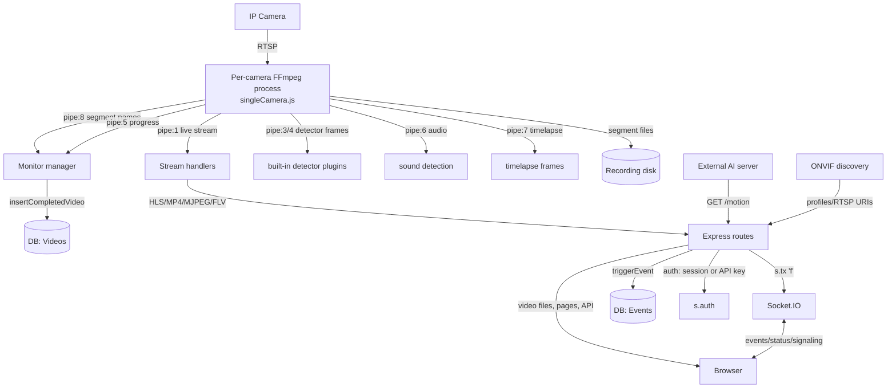

# VMS — Data Flow & API Reference

Consolidated reference: the end-to-end data flows, the database schema, the full HTTP API
catalog, the realtime (Socket.IO) surface, and the internal IPC pipes. Companion to
[`01-HLD`](01-HLD-High-Level-Design.md) and [`02-LLD`](02-LLD-Low-Level-Design.md).

---

## 1. System-wide data flow (all paths on one diagram)



---

## 2. Internal IPC — the per-camera stdio pipe map

Each camera is a detached `node singleCamera.js` process wrapping FFmpeg. The parent and
child communicate over a **fixed-index stdio pipe array** (`createPipeArray`,
`backend/libs/ffmpeg/utils.js:176`). This is the backbone of both recording and streaming.

| Pipe fd | Direction | Carries | Consumer |
|---------|-----------|---------|----------|
| `pipe:1` | child → parent | Live stream (MP4/FLV/MJPEG/b64 muxed output) | Stream handlers → mp4frag / emitter |
| `pipe:3` | child → parent | Built-in motion detector frames (PAM) | pam-diff plugin |
| `pipe:4` | child → parent | Object-detector frames (MJPEG) | object detector plugin |
| `pipe:5` | child → parent | FFmpeg `-progress` output | health/heartbeat |
| `pipe:6` | child → parent | Audio (PCM) for sound detection | sound-detection |
| `pipe:7` | child → parent | Timelapse frames (MJPEG) | timelapse writer |
| `pipe:8` | child → parent | **Completed segment filenames** (`-segment_list`) | `catchNewSegmentNames` → DB |
| `dataPort` | child ↔ main | WebSocket control channel (config, commands) | `dataPortConnection.js` |

> A camera also carries its FFmpeg command via a `cmd_<token>.txt` handoff file the child
> reads on startup (`backend/libs/ffmpeg.js:71`, now written async).

---

## 3. Database schema

**Engine:** one knex instance over **sqlite3 / mysql(2) / postgres** (configurable). Tables
are created idempotently in code at startup (`preQueries.js:8-221`) plus dated additive
migrations (`database/migrate/*.js`). **Multi-tenancy is row-level:** nearly every table
carries `ke` (group/customer key) and `mid` (monitor id). **No foreign keys.**

| Table | Purpose | Key columns |
|-------|---------|-------------|
| **Monitors** | Camera definitions (the config for each camera) | `ke, mid, name, type, ext, protocol, host, port, path, details(JSON), mode` |
| **Videos** | Every recorded segment = one row (the recording index) | `ke, mid, time(start), end, ext, status, details, objects, size, archive, saveDir` |
| **Cloud Videos** | Segments offloaded to cloud storage (S3/B2/etc.) | mirror of Videos |
| **Events** | Detections/motion events (incl. external AI via /motion) | `ke, mid, time, details(reason,confidence,...), objects` |
| **Events Counts** | Aggregated event/line-crossing counts | `ke, mid, tag, count, time` |
| **Users** | Group/admin accounts | `ke, uid, email, pass, details(JSON permissions)` |
| **API** | API keys scoped to a group (for programmatic + AI access) | `ke, uid, code, ip, details(permissions)` |
| **LoginTokens** | Persistent login tokens (Google/LDAP/token auth) | `ke, uid, details` |
| **Files** | fileBin — exported/cut clips + uploads | `ke, mid, name, size, details, saveDir` |
| **Timelapse Frames** | Periodic snapshot frames for timelapse build | `ke, mid, time, filename, saveDir` |

> `getDatabaseRows` + `sqlQueryBetweenTimesWithPermissions`
> (`database/utils.js:177-417`) are the time-range + permission-scoped readers behind the
> videos/events REST endpoints. DB execution is serialized to **max 4 concurrent jobs**
> (`runQuery` async.queue, `database/utils.js:4`).

**Child-node bridge:** a child node has **no local DB** — `s.knexQuery`/`s.sqlQuery` are
monkey-patched to send the query over WebSocket to the master, which runs it and returns
rows by callback id (`childNode.js:159-174`, `childNode/utils.js:46-82`).

---

## 4. HTTP API catalog (~130 routes)

Path params: `:auth` = session/API token, `:ke` = group key, `:id` = monitor id. Prefixes
(`apiPrefix=/`, `adminApiPrefix=/admin/`, `superApiPrefix=/super/`) are configurable.
**Every route is gated by `s.auth`** unless noted.

### 4.1 Auth & session
| Method | Route | Purpose |
|--------|-------|---------|
| POST | `/` , `/super`, `/:screen` | Login |
| GET | `/:auth/logout/:ke/:id` | Logout |
| GET | `/:auth/userInfo/:ke` | Current user info |
| GET | `/:auth/loginTokens/:ke[/:loginId[/delete]]` | Manage persistent login tokens |
| GET/POST | `/:auth/loginTokenAddGoogle/:ke`, `.../LDAP/:ke` | External auth linking |
| POST | `[/admin]/:auth/api/:ke/add\|delete`, GET `.../list\|get/:code` | **API key management** (used by AI/integrations) |

### 4.2 Monitors (camera CRUD + control)
| Method | Route | Purpose |
|--------|-------|---------|
| GET | `/:auth/monitor/:ke[/:id]` | Get monitor config(s) |
| ALL | `[/admin]/:auth/configureMonitor/:ke/:id[/:f]` | **Create/edit/delete a camera** |
| GET | `/:auth/monitor/:ke/:id/:f[/:ff[/:fff]]` | Per-monitor actions (start/stop/etc.) |
| GET | `/:auth/toggleSubstream/:ke/:id` | Toggle the on-demand substream |
| GET | `/:auth/control/:ke/:id/:direction` | Basic movement control |
| ALL | `/:auth/monitorStates/:ke[/:stateName[/:action]]` | Saved monitor state presets |

### 4.3 Recording playback, export, timeline
| Method | Route | Purpose |
|--------|-------|---------|
| GET | `/:auth/videos/:ke[/:id]` | **List recordings** (time-range + permission scoped) |
| GET | `/:auth/videos/:ke/:id/:file` | **Play a recording** (Range/seek-capable) |
| GET | `/:auth/videos/:ke/:id/:file/:mode[/:f]` | Per-video actions incl. **`slice`** (cut a clip) |
| POST | `/:auth/mergeVideos/:ke/:id` | **Merge** segments into one clip |
| GET | `/:auth/videosByEventTag/:ke[/:id]` | Recordings filtered by event tag |
| GET | `/:auth/wallvideoview/:ke` | **Timeline** wall view page |
| GET | `/:auth/videoBrowser/:ke[/:id[/:date]]` | Calendar/date video browser |
| GET | `/:auth/fileBin/:ke[/:id[/:file[/:mode]]]` | **Exported clips** (list/download/delete) |
| POST | `/:auth/videos/:ke/:id` | Upload a video |
| GET | `/:auth/timelapse*`, POST `/:auth/timelapseBuildVideo/:ke[/:id]` | Timelapse browse + build |

### 4.4 Live streaming
| Method | Route | Purpose |
|--------|-------|---------|
| GET | `/:auth/hls/:ke/:id[/:channel]/:file` | HLS playlist/segments |
| GET | `/:auth/mp4/:ke/:id[/:channel]/s.mp4\|s.ts` | **MP4/mp4frag (MSE, low-latency)** |
| GET | `/:auth/mjpeg/:ke/:id[/:channel]` | MJPEG stream |
| GET | `/:auth/flv/:ke/:id[/:channel]/s.flv` | FLV stream |
| GET | `/:auth/h264\|mpegts/:ke/:id/...` | Raw H.264 / MPEG-TS feed |
| GET | `/:auth/jpeg/:ke/:id/s.jpg` | Live snapshot |
| GET | `/:auth/icon/:ke/:id` | Camera thumbnail |
| GET | `/:auth/embed/:ke/:id[/:addon]` | Embeddable live player |
| GET | `/:auth/wallview/:ke` | **Video wall** page |

### 4.5 Events / AI integration
| Method | Route | Purpose |
|--------|-------|---------|
| GET | `/:auth/motion/:ke/:id` | **THE AI SEAM** — external detection → record + live alert (`?reason=&confidence=&name=`) |
| GET | `/:auth/events/:ke[/:id]` | List events/detections |
| GET | `/:auth/eventCounts/:ke[/:id]` | Line-crossing / counting totals |
| GET | `/:auth/eventCountStatus/:ke/:id` | Event count status |
| GET | `/:auth/hookTester/:ke/:id` | Test the event hook |
| POST | `/:auth/detectionSnapshot/:ke/:id` | (custom) store a detection snapshot image |

### 4.6 Discovery, ONVIF, PTZ, control
| Method | Route | Purpose |
|--------|-------|---------|
| GET | `/:auth/probe/:ke` | Network scan / probe for cameras |
| GET/POST | `/:auth/onvifDeviceManager/:ke/:id[/save\|reboot]` | ONVIF device management |
| ALL | `/:auth/onvif/:ke/:id/[:service/]:action` | ONVIF actions |
| GET/POST | `/:auth/onvifPresets\|onvifSetPreset\|onvifGoToPreset\|onvifStartPatrol\|...` | **PTZ presets & patrol** |
| GET/POST | `/:auth/zwave/:ke/:action` | Z-Wave devices |
| GET/POST/DELETE | `/:auth/floorplans/:ke[/:filename]` | Floor-plan CRUD |
| GET/POST | `/:auth/alarm[s]/:ke[/:id]` | Alarm zones |

### 4.7 Super-admin / system (all `/super/`)
| Method | Route | Purpose |
|--------|-------|---------|
| GET/POST | `/super/:auth/system/configure` | Read/write system config |
| ALL | `/super/:auth/system/update`, `.../restart/:script` | Update / restart |
| POST | `/super/:auth/system/activate` | License activation |
| GET | `/super/:auth/system/info` | System info |
| ALL | `/super/:auth/accounts/list\|registerAdmin\|editAdmin\|deleteAdmin\|saveSettings` | Account admin |
| ALL | `/super/:auth/export\|import/system` | Config export/import |
| GET | `/super/:auth/getChildNodes` | **Cluster: list child nodes** |
| GET/POST | `/super/:auth/plugins/*`, `/super/:auth/package/*` | Plugin/package management |
| GET/POST | `/super/:auth/mgmt/*`, `/super/:auth/p2p/save` | Remote-management + P2P tunnel |
| ALL | `/super/:auth/mountManager/*` | Storage mounts (Unix only) |

### 4.8 Sub-accounts, permissions, misc
| Method | Route | Purpose |
|--------|-------|---------|
| GET/POST | `/admin/:auth/accounts/:ke[/register\|edit\|delete]` | Sub-account management |
| GET/POST | `/:auth/permissions/:ke[/:name[/delete]]` | Permission sets |
| GET/POST | `/:auth/customSettings/:ke[/:name]` | Custom settings store |
| ALL | `/:auth/schedule[s]/:ke[/:name[/:action]]` | Scheduling |
| GET | `/:auth/definitions\|language[s]\|storageLocations\|hardwareAccels/:ke` | UI metadata |

**Separate servers:** the pair server (`POST /mgmt/connect`, port 8091) and the standalone
`ffmpegToWeb.js` dev tool are not part of the main web server.

---

## 5. Realtime surface (Socket.IO)

The browser holds a Socket.IO connection for live push. Rooms are keyed by group
(`GRP_<ke>`) and per-monitor (`MON_<ke><mid>`). Key messages:

| Event `f` | Direction | Meaning |
|-----------|-----------|---------|
| `f` (detection) | server → client | A detection/event fired (drives Recent Alerts) — `s.tx(...,'GRP_'+ke)` |
| `monitor_status` / `monitor_edit` | server → client | Camera state changed |
| `monitor_starting` / `monitor_watch_on` / `monitor_stopping` | server → client | Camera lifecycle transitions |
| `viewer_count` | server → client | Number of live viewers on a monitor |
| `watch_on` / `watch_off` | client → server | Start/stop viewing (drives substream lifecycle) |
| `init_success`, `os`, `diskUsed` | server → client | System telemetry for the dashboard |

Broadcast primitive: `s.tx(data, room)` → `io.to(room).emit('f', data)`
(`backend/libs/socketio.js`).

---

## 6. The pluggable-AI contract (for the external GPU server)

The **only** two things an external AI service does:

1. **Read frames:** open the camera's RTSP URL (same URL the VMS stores) and sample frames.
2. **Report a detection:**
   ```
   GET /<API_KEY>/motion/<GROUP_KEY>/<MONITOR_ID>?plug=<name>&name=<evt>&reason=<Type>&confidence=<0-100>
   ```
   - `reason` is an **opaque label** — the VMS records it and pushes it live; the frontend
     registry styles any type with a neutral default (no VMS code change for a new type).
   - Gated by the monitor's `detector`/`detector_http_api` settings and its API key
     (IP-scoped). Records a clip when the monitor has `detector_trigger` + a recording mode.

That is the entire integration surface. Everything else (recording, streaming, storage,
users) is internal to the VMS and unaffected by which AI services are enabled.
