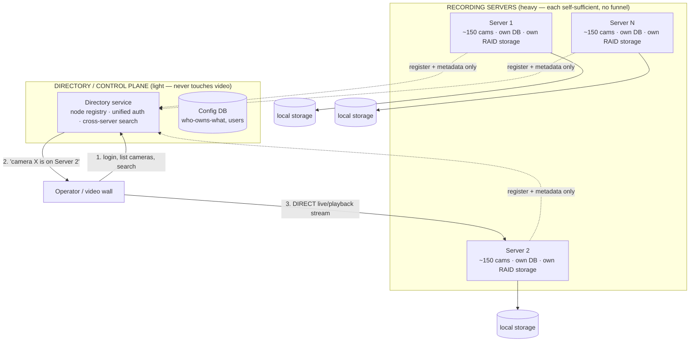

# VMS — Scaling Architecture: Fixing the Master Bottleneck

**Question this answers:** the current master/child cluster funnels every child's database
queries, recorded files, and live streams through one master — a bottleneck and a single
point of failure. How do we fix it, what do world-class VMS platforms do, and what do we
actually build for hundreds of cameras?

**Bottom line up front:** **Don't fix the cluster — replace it with independent standalone
servers plus a thin directory layer.** This is what every major commercial VMS does, and in
this codebase it's a **configuration change at the core** (the master funnels are the
*design* of the cluster, not bugs you can patch). The real work is a new directory/control
layer on top — which never touches video.

> Researched against real VMS platforms and verified against this codebase (file:line
> throughout). Two independent pressure-test passes added the honest HA caveats in §6.

---

## 1. Why the current cluster can't just be "fixed"

The master/child cluster centralizes three things **by design** — patching them out would
mean deleting the cluster's reason to exist:

| What the master centralizes | Where in code | Why it bottlenecks |
|---|---|---|
| **Database** — children have no DB; every query is shipped over one websocket to the master's single pool (default **max 10 connections** for the whole fleet) | `childNode.js:159-174`, `childNode/utils.js:58-67`, `sql.js:8-9` | Every event/motion/video-row/read from hundreds of cameras serializes through one DB pool |
| **File storage** — every finished MP4 is streamed to the master's disk, which writes it and deletes the child's copy | `videos.js:145-158`, `childNode/childUtils.js:104-138` | All video for the whole fleet lands on the master's one disk + NIC |
| **Live view** — a child-owned camera's stream is reverse-proxied through the master to the browser | `webServerPaths.js:64-71`, `webServerStreamPaths.js` (every stream route) | A wall of many cameras saturates the master's single proxy + NIC |

Plus the master is a **hard single point of failure**: if it dies, children **kill all their
FFmpeg processes** and the whole fleet stops recording (`childUtils.js:71-86`). For a
security product, that is unacceptable.

**Conclusion:** these are inherent to the funnel design. The fix is to not funnel.

---

## 2. How the world's VMS platforms actually scale

Every enterprise VMS that scales past a few hundred cameras uses the **same core pattern**:

> **Separate the control plane (metadata, tiny) from the media plane (video, heavy). Keep
> video OFF the coordinator. Clients connect DIRECTLY to the server that owns a camera.**

| Platform | Coordinator (light) | Recorder (heavy, owns storage + DB) | Client stream path |
|----------|--------------------|-------------------------------------|--------------------|
| **Milestone XProtect** | Management Server (SQL config DB: cameras, users, rules) | **Recording Servers** — each pulls its own cameras' RTSP, writes to its **own media DB** on local/attached disk | Client asks mgmt server "who owns cam X?" → connects **directly** to that Recording Server |
| **Genetec Security Center** | Directory role (SQL config catalog + auth) | **Archiver roles** — record to disk, keep **own metadata DB** | Directory tells client which Archiver → **direct** stream (via Media Router) |
| **Network Optix / Nx Witness** | **None** — fully peer-to-peer; every server holds a replicated copy of config | Every server records **only its own cameras** to its own storage | Connect to any server → transparently redirected to the **owning** server |
| **Axis Camera Station** | Aggregation client (directory/monitoring view) | Each server owns its cameras + storage + DB | Multi-server clients aggregate; video stays on each server |

**The universal rules:**
- The coordinator holds a **small config/metadata DB** and answers *"who owns camera X"* — it
  **never proxies video** or centralizes recording files.
- **Recording servers own their storage + their own DB.** Video never leaves the server that
  recorded it.
- Clients are **redirected** to the owning server, then the coordinator gets out of the way.
- Scale = **add more recording servers**, each owning a shard of cameras.
- Multiple sites are joined by **federation** — independent systems under one client, DBs
  never merged.

**Our current cluster is the exact anti-pattern** (master funnels the media plane through
the control plane). The fix is to adopt the standard model.

---

## 3. The good news: this codebase already supports the right model

A single Shinobi process is **already a complete standalone NVR** when the cluster is
disabled (`childNodes.enabled=false` — the default, `config.js:62-64`). In that mode:

- **DB is per-process** — each box builds its own knex engine from its local config; SQLite
  is supported (`sql.js:4-12`, `database/utils.js:442`). Each server can own a local DB.
- **Storage is per-process** — recordings write to the local disk (`videos.js:159-198`).
- **Live view is served locally** — the master-proxy (`checkChildProxy`) is a **no-op**
  unless a camera is bound to a child, which only happens in cluster mode
  (`webServerPaths.js:64-71`).

> **So "N independent servers, each with its own cameras + DB + disk + live view" requires
> ZERO core code changes — only configuration.** The three bottlenecks disappear *by
> construction* because those code branches only activate in cluster mode.

---

## 4. The target architecture

- **Recording servers**: unchanged Shinobi in standalone mode. Each owns a fixed set of
  cameras (its own `conf.json`), records to its own RAID disk, keeps its own DB. **No file
  relay, no SQL proxy, no view proxy — no bottleneck.**
- **Directory service** (new, thin): one login for the operator, an inventory of which
  camera lives on which server, and cross-server search. It **routes**; it never carries
  video bytes.

---

## 5. What to build — phased plan

### Phase 0 — Stop using the cluster (config-only, do now)
Deploy every server **standalone** (`childNodes.enabled=false`). This single choice removes
**all three bottlenecks at once** and eliminates the master as a fleet-wide single point of
failure. Zero code change. **This alone unblocks hundreds of cameras** (2–4 servers × ~150).

### Phase 1 — Thin directory / one pane of glass (the real new work)
A small new service on top. Honest scope — it is a **control plane, not a shim** — with
three real workstreams:
1. **Node registry** — a list (static config or heartbeat) of each recording server's
   base URL + which cameras it owns.
2. **Federated auth (SSO)** — the biggest hidden cost. Today each server has its own users
   and its own session tokens scoped to its own group. Options: a shared JWT signing
   key/OIDC provider all servers trust, so one login works fleet-wide.
3. **Unified search + live routing** — scatter-gather a query across all servers, merge and
   paginate results (needs synced clocks — see §6); for live view, **deep-link or
   thin-proxy on demand only** to the owning server's stream URL (reuse the existing proxy
   pattern, but per-viewed-stream, never the whole fleet).

### Phase 2 — Federation for many sites / thousands (later)
Multiple directories joined in a tree (the Milestone/Genetec federation model), object
storage (S3-style) so no single disk is a sink, and camera-to-server rebalancing tooling.

**Camera count → what you need:**

| Cameras | Architecture | New build |
|---------|--------------|-----------|
| 1–300 | 1–2 standalone servers | none (config) |
| 300–1,000 | several standalone servers + Phase-1 directory | the directory service |
| 1,000–3,500+ | + Phase-2 federation + object storage | federation + rebalancing |

---

## 6. The honest caveats (from the pressure-test) — REQUIRED for a security product

Standalone servers give **failure isolation** (one server down = only its cameras affected,
not the whole fleet) — but that is **NOT the same as high availability**. "Recording never
lost" at hundreds of cameras demands these as **requirements, not options**:

1. **RAID 6 or 10 on every recording node** (never RAID 5 at these disk sizes — rebuild
   windows are too risky). Standalone removes the accidental child→master second copy that
   exists today, so on-disk redundancy is now essential.
2. **Per-node DB durability** — SQLite with WAL + fsync, or MySQL primary/replica — **plus
   scheduled off-box backups with a tested restore drill.** Each node's DB is now its own
   crown jewel.
3. **Recording replication** — a second on-disk copy or backup target, so a single disk or
   node loss doesn't lose footage. If recording must survive a *host* dying, add **N+1
   recorder failover** (a standby that picks up a camera when its primary dies) — standalone
   alone does not provide this.
4. **Watchdogs at two levels** — process auto-restart (systemd `Restart=always`) **and**
   liveness on file growth ("process alive but not recording" is a distinct failure) **and**
   a host/hardware watchdog for kernel hangs.
5. **The directory is itself a new SPOF** — it needs redundancy and must degrade gracefully:
   if it's down, recording continues on every node; only the unified view is lost.
6. **NTP time-sync across all nodes** — the merged/aggregated timeline and retention math are
   only trustworthy if every recorder shares a clock. Skew silently corrupts cross-server
   search sort/pagination.
7. **Per-node retention + total-storage reporting** must be aggregated by the directory
   (retention now runs per-node, `childNode/utils.js:190`).

---

## 7. One-paragraph summary

The master bottleneck is inherent to the cluster's funnel design, so we don't fix it — we
adopt the model every major VMS uses: **independent recording servers that each own their
cameras, storage, and database, with a thin directory on top that routes clients directly to
the owning server and never touches video.** In this codebase, running standalone is a
**config change** (the funnels only exist in cluster mode), which immediately unblocks
hundreds of cameras across 2–4 servers. The genuine new work is the **directory service**
(node registry + federated SSO + cross-server search), plus the **durability requirements**
(RAID 6/10, DB backups + replication, recording redundancy, watchdogs, NTP) that a security
product must have regardless of architecture. Thousands of cameras then follows the same
model extended with federation and object storage — the same codebase, no rewrite of the
recording core.
